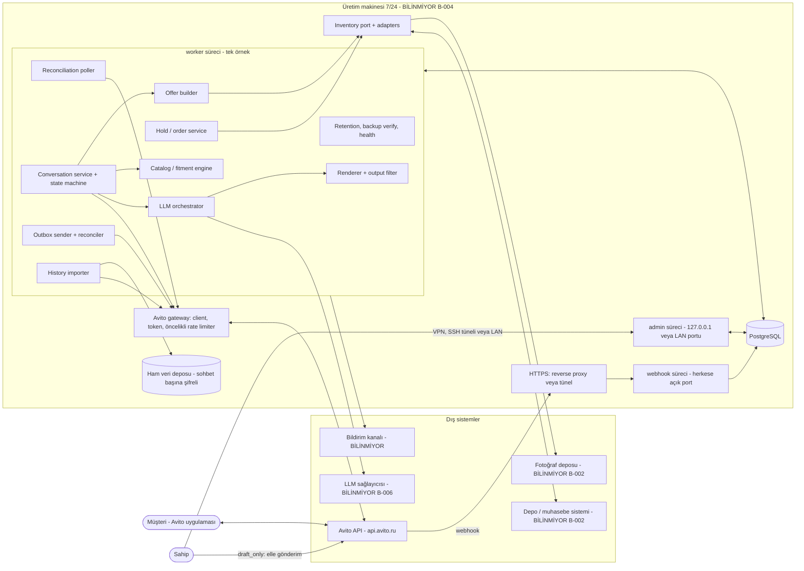
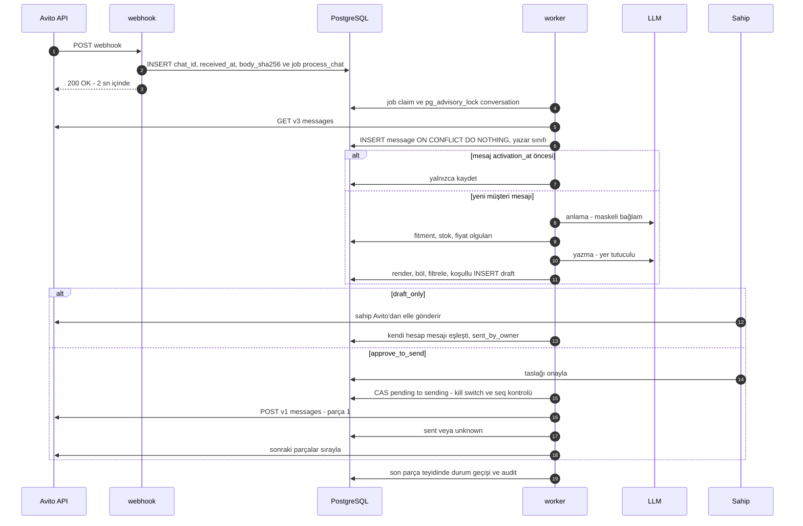
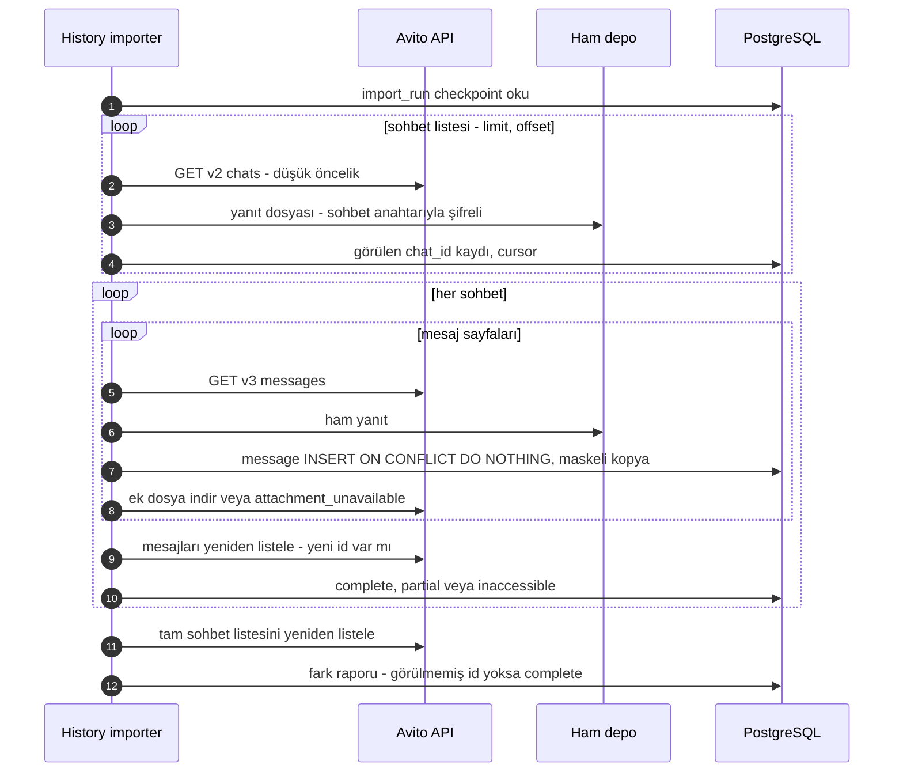
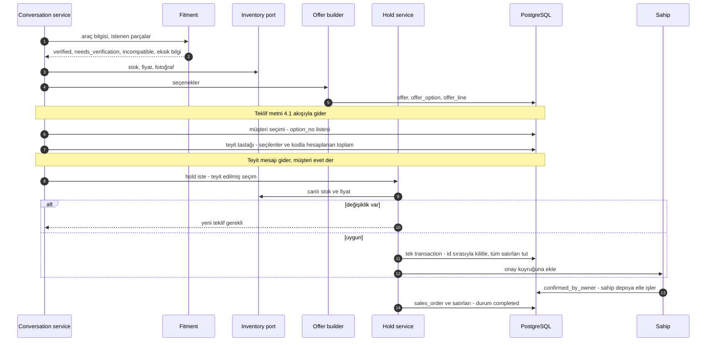
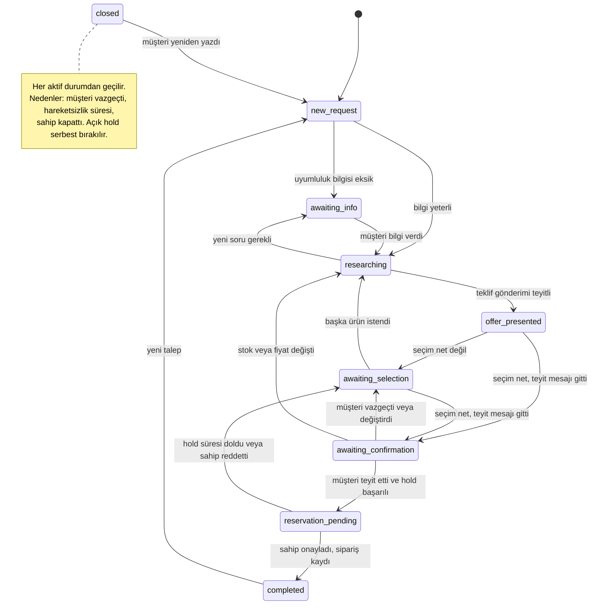
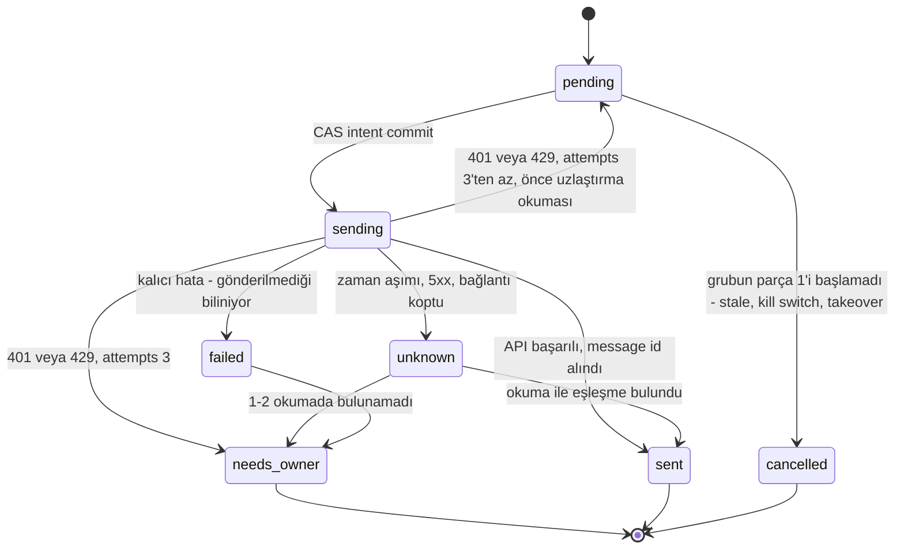
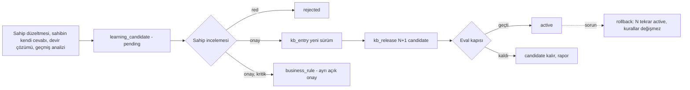
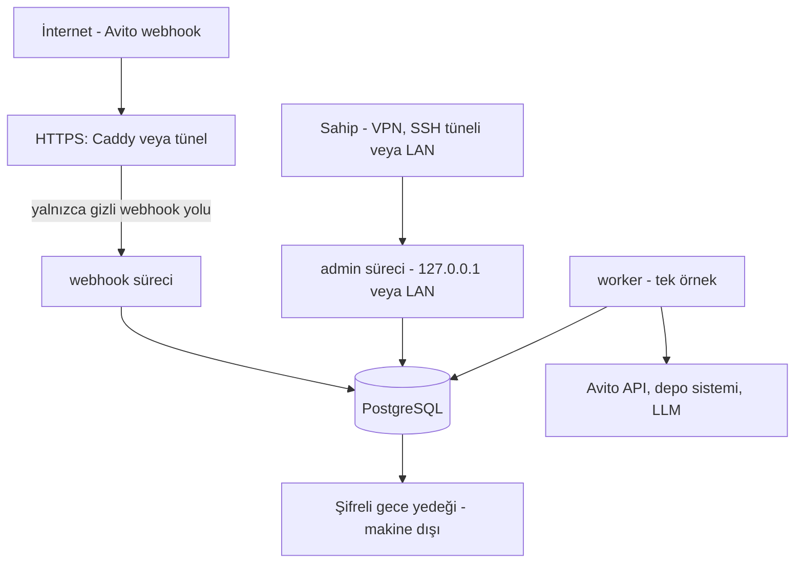

# ARCHITECTURE — Mimari ve veri akışları

> **KABUL EDİLDİ — rev.2 (T-004; T-012, T-012b incelemeleri), 2026-09-27.** Hazırlayan: Mimari agent'ı.
> Bu belge somut ve uygulanabilir bir mimaridir. Bilinmeyene bağlı her parça "BİLİNMİYOR" ya da **keşif sonrası kesinleşecek (D-010)** diye işaretlidir ve [../BLOCKERS.md](../BLOCKERS.md) kimliğine bağlıdır. Belgenin kendi önerileri §16'da ÖK-n olarak listelenir. Main Agent'ın bu revizyonda verdiği kararlar MA-1…MA-7 olarak anılır (§16). Kabulle birlikte ikisi de [DECISIONS.md](DECISIONS.md)'ye D-015–D-035 olarak işlendi; §16'daki "onay bekliyor" / "işlenecek" ifadeleri kabul öncesi metindir.

**Kaynaklar**

- Gereksinimler: [OWNER_REQUEST_2026-09-27.md](OWNER_REQUEST_2026-09-27.md), [PROJECT_BRIEF.md](PROJECT_BRIEF.md).
- Kararlar: [DECISIONS.md](DECISIONS.md), özellikle D-011 (üretim kanalı Messenger API), D-012 (önce derinlik ölçümü, T-010) ve D-013 (kendi ince istemcimiz).
- Ortam ve Avito olguları (T-001/T-002 bulguları) ile güven etiketleri: yalnızca [INTEGRATIONS.md](INTEGRATIONS.md) §2–§6. Bu belge o içeriği tekrar etmez. Avito olguları resmî spec'in topluluk kopyasına dayanır ve canlı doğrulanmamıştır.
- Aşamalar: [PLAN.md](PLAN.md).

## 1. Temel ilkeler

1. **Tek makinede modüler monolit.** Dört süreç çalışır: `webhook`, `admin`, **tek** `worker` ve PostgreSQL. Önlerinde HTTPS katmanı bulunur. Mikroservis, ayrı kuyruk sunucusu ya da Kubernetes yoktur.
2. **LLM yalnızca dil işi yapar.** İki işi vardır: mesajı anlamak (yapılandırılmış çıkarım) ve cevabın serbest cümlelerini yazmak. Rakamlar, seçenek listesi, toplamlar, uyumluluk kararı, durum geçişi, rezervasyon ve gönderim deterministik koddadır. LLM'in hiçbir yazma aracı yoktur.
3. **Önce niyet, sonra dış etki.** Dış etkili her işlem sırayla niyet kaydı (koşullu UPDATE ile), işlem ve sonuç kaydından oluşur. Sonuç belirsiz kalırsa **otomatik yeniden gönderim yapılmaz**; önce gerçek durum sorgulanır, sonra sahibe devredilir (MA-1).
4. **Her durum geçişi bir CAS'tır** (koşullu UPDATE: `… WHERE id = :id AND status = :beklenen`). Etkilenen satır sayısı 0 ise geçiş olmamış demektir. Bu kural konuşma, taslak, outbox, rezervasyon ve job tablolarının hepsi için geçerlidir.
5. **Portlar ve adaptörler.** Avito, depo/muhasebe, fotoğraf deposu, LLM, bildirim ve yedek hedefi birer arayüzün arkasındadır. Bilinmeyen her sistem için önce açıkça etiketli bir **sentetik** adaptör yazılır.
6. **Pilot modları yalnızca `draft_only` ve `approve_to_send`'dir** (MA-2). Onaysız otomatik gönderim (`auto_scoped`) pilot sonrasına bırakılmıştır (§15).
7. **Webhook tetikleyicidir; doğruluk kaynağı API'dir.** Webhook'tan yalnızca "şu sohbette yenilik var" bilgisi alınır. İçerik her zaman API'den okunur. Poller her zaman açıktır.

## 2. Bağlam ve bileşen diyagramı

`webhook` süreci yalnızca kayıt yazar ve 200 döner; dış çağrı yapmaz. `admin` süreci ayrı bir porttadır ve yalnızca 127.0.0.1'e ya da LAN'a bağlanır. Dış API ve LLM çağrılarını yalnızca `worker` yapar. Tüm uzun işler PostgreSQL'deki `job` kuyruğundan yürür.

## 3. Bileşenler ve sorumluluklar

| Bileşen | Sorumluluk | Notlar |
|---|---|---|
| **Avito gateway** | Spec'ten yazılmış ince istemci (D-013). Token yönetimi, **öncelikli** rate limiter (§6.10), hata sınıflandırması: `retryable_read`, `not_delivered`, `ambiguous`, `auth`, `rate_limited`, `permanent`. | Uç noktalar [INTEGRATIONS.md](INTEGRATIONS.md) §3.1'deki gibidir. Silme ve blacklist yalnızca sahibin yönetim ekranındaki eylemleridir. |
| **Webhook receiver** | `chat_id`, `received_at` ve `body_sha256` yazar, `process_chat` işi ekler, 200 döner. **Ham gövdeyi saklamaz.** Ayrıştırılamayan gövde için tek bir `poll_all` işi açar. | URL'de gizli yol token'ı bulunur (imza algoritması yayımlanmadı). Gövde boyutu sınırlıdır. |
| **Reconciliation poller** | Sohbet listesinden her sohbetin son mesajını karşılaştırır ve değişen sohbetler için `process_chat` açar. | Liste sıralaması doğrulanana kadar (T-010, §10.1) tam liste taranır. |
| **Conversation service** | İş durumu makinesi (§4.4), `automation` bayrağı, bağlam derleme, taslak üretimi, eski taslağı geçersiz kılma, yazar sınıflandırması (§6.3), sahip mesajı eşleştirme (§6.6). | Konuşma başına advisory lock altında çalışır (§6.1). |
| **Inventory port** | `search_products`, `get_stock`, `get_price`, `get_photos`, `health`. Yazma yetenekleri (`reserve`, `create_order`) v1'de **yoktur** (MA-5). | `SyntheticInventoryAdapter` yalnızca geliştirme içindir: `data_origin=synthetic`, `SYN-` önekli SKU; `APP_ENV=production` iken başlamayı reddeder. Gerçek adaptör T-007 sonrasında yazılır. |
| **Catalog / fitment engine** | Ürün modeli, set ilişkileri ve uyumluluk değerlendirmesi. Çıktısı `verified` / `needs_verification` / `incompatible` durumu, kanıt, kaynak ve eksik bilgi listesidir. | Deterministiktir. Görsel benzerlik, LLM çıktısı, müşteri beyanı ve "W213" tek başına kanıt türü değildir. |
| **Offer builder** | `offer` → `offer_option` → `offer_line` modeli. Tutarlar tamsayı minor unit ile tutulur (RUB için копейка). Seçenek bloğu kod şablonuyla üretilir. | Seçilen seçeneklerin toplamını kod hesaplar (§4.3). |
| **Hold / order service** | Açık teyit adımı, yerel atomik tutma, sahip onayı ve sipariş kaydı. Sipariş durumu ile ödeme durumu ayrı tutulur. | Harici yazma v1'de yoktur (MA-5). |
| **LLM orchestrator** | Sağlayıcı soyutlaması, yapılandırılmış çıktı, olgu kağıdı, maliyet sayacı, devre kesici. | §3.1'e bakın. |
| **Renderer + output filter** | Yer tutucuları doldurur, metni ≤1000 karakterlik parçalara böler ve **son hâline** filtre uygular. | §7.2'ye bakın. Parçalar taslak anında kesinleşir. |
| **PII masker** | E-posta, sosyal hesap, URL, kart, telefon, VIN ve Rus plakası (госномер) desenlerini `[PHONE_1]` biçimindeki tiplenmiş yer tutucularla değiştirir. | T-014'te tamamlandı (commit 11694f5). Ad ve adres kapsanmıyor (§7.4). |
| **KB + learning** | `kb_entry`, tek kaynaklı `business_rule`, artan tamsayı `kb_release`, öğrenme adayları. | §9'a bakın. |
| **Eval harness** | Sabit senaryolar ve deterministik kontrollerden oluşan sürüm kapısı. | LLM hakem sonraki sürümdedir. |
| **History importer** | API öncelikli aktarım: yeniden listeleme doğrulaması, ek dosyalar, rapor. | §10'a bakın. |
| **Admin UI** | Sahip için Türkçe ekranlar (§11). | Ayrı port, yalnızca yerel veya LAN. |
| **Audit log** | Yalnızca eklemeye açık `audit_event` tablosu; içinde yalnızca kimlikler bulunur. | Biçim [../AGENTS.md](../AGENTS.md) §7'deki gibidir. |
| **Kill switch / takeover** | Global `kill_switch`; konuşma başına `automation=paused` ve neden. | §6.13'e bakın. |
| **Retention job** | Veri sınıfı başına saklama ve silme; sohbet başına kripto-silme. | Süreler sahip kararıdır (MA-6, B-010). |
| **Notifier** | Uyarıları sahibe iletir (port). | Kanal BİLİNMİYOR; yönetim ekranındaki uyarı bandı her durumda gösterilir. |

### 3.1 LLM orchestrator — bir mesaj turu

1. **Bağlam (kod):** Yalnızca bu konuşmanın maskeli mesajları, ilan bağlamı ve iş durumu toplanır. Önceki turların LLM özeti de eklenebilir, ancak **güvenilmeyen veri** olarak işaretlenir ve olgu kağıdına asla girmez.
2. **Anlama (LLM, JSON şema):** `language`, `intents[]`, `vehicle{…}`, `requested_parts[]`, `selection[]` (seçenek numaraları), `confirms` (evet/hayır), `withdraws`, `asks_if_bot`, `wants_human`. Şemaya uymayan çıktı reddedilir, bir kez yeniden denenir, sonra işlem sahibe gider.
3. **Karar (kod):** Durum makinesi ve politika bir sonraki eylemi seçer: `ask_info`, `offer`, `answer_faq`, `confirm_selection`, `bot_disclosure`, `ack_withdrawal`, `pause_for_owner`.
4. **Olgu kağıdı (kod):** Kimlikli olgulardan oluşur; öncelik kuralı §9.1'de uygulanır. Kağıt ayrıca `allowed_literals` listesi taşır: şase kodu (ör. W213), yıl, OEM ve SKU gibi, kaynağı kayıtlı değerler.
5. **Yazma (LLM, JSON şema):** Çıktı yer tutucu içeren serbest cümlelerdir, ör. `{{offer_block}}`, `{{total}}`, `{{rule:delivery_text}}`. Rakam ve para birimi yazmak LLM'e yasaktır (§7.2). Seçenek bloğu, teyit mesajı, dürüst "asistan" cevabı ve bekleme mesajı kod şablonlarıdır. Şablonlar önce Rusça hazırlanır; başka dil için şablon yoksa cevap sahibe gider.
6. **Render, böl, filtrele (kod):** Son parçalar üretilir ve her parça filtreden geçer. `used_fact_ids`/`claims` alanları **yalnızca denetim içindir**; güvenlik kontrolü değildir. Güvenlik kontrolü yer tutucu kuralı ve filtredir.

**Araçlar:** Varsayılan tasarımda LLM'e araç verilmez. İleride açılabilecek araçlar yalnızca salt okunur `kb_search` ve `catalog_search`'tür; kapsam parametreleri sunucu tarafından enjekte edilir. Yazma, gönderim, silme, blacklist ve rezervasyon hiçbir zaman araç olarak sunulmaz.

**Sağlayıcı:** `LLMProvider.generate_structured(purpose, schema, messages, limits)`. Adaptör seçimi §7.5 ve B-006'ya bağlıdır. Prompt dosyaları Git'te sürümlenir; taslak `prompt_version` (dosya sürümü) ve `model_id` alanlarını taşır.

## 4. Veri akışları

### 4.1 Yeni mesaj

- **Go-live filigranı:** `system_setting.activation_at` değerinden önce oluşturulmuş mesajlar (`created_at_avito ≤ activation_at`) yalnızca kaydedilir, taslak tetiklemez. İlk tarama her zaman yalnızca kayıt yapar.
- **`draft_only` (MA-3):** Sahip taslağı yönetim ekranında görür, gerekirse düzeltir ve kendisi Avito'dan gönderir. Eşleştirme §6.6'da anlatılmıştır.
- **`approve_to_send`:** Onay, taslağın **hazır parçalarını** outbox'a koyar; gönderilen metin tam olarak onaylanan metindir.
- **Okundu işareti:** `chatRead` pilot modlarında hiç çağrılmaz (D-012'deki yan etki kaygısı).
- **Metin dışı gelen içerik** (image, voice, file vb.): Mesaj kaydedilir, konuşma `paused(unsupported_content)` olur.

### 4.2 Geçmiş aktarımı

Aktarılan mesajlar `source=history_import` ile işaretlenir ve taslak tetiklemez (bu mesajlar zaten filigranın öncesindedir).

### 4.3 Teklif → teyit → tutma → sahip onayı → sipariş

- Toplam, müşterinin seçtiği `offer_option` satırlarından kodla hesaplanır: Σ `line_total_minor`. LLM toplam hesaplamaz.
- Müşteriye "ayrıldı" veya "sipariş oluşturuldu" yazan şablon yalnızca `confirmed_by_owner` kaydı varsa kullanılabilir (§7.2). Ödeme durumu ayrı bir alandır.

### 4.4 İş durumu makinesi (talep §7)

| Talep §7 | Kod karşılığı |
|---|---|
| yeni talep | `new_request` |
| bilgi bekleniyor | `awaiting_info` |
| ürün araştırılıyor | `researching` |
| teklif sunuldu | `offer_presented` |
| seçim bekleniyor | `awaiting_selection`, `awaiting_confirmation` |
| rezervasyon/sipariş bekleniyor | `reservation_pending` (yerel hold + sahip onayı bekleniyor) |
| tamamlandı | `completed` = sipariş **sahip tarafından onaylandı**. Ödeme `payment_status` alanında ayrıca izlenir. |
| insana devredildi | Ayrı bir durum değildir (MA-4): `automation=paused` + `paused_reason`. İş durumu korunur. |
| (kapanış) | `closed`: `close_reason` ∈ {`customer_withdrew`, `inactive`, `owner_closed`} |

- Geçişler yalnızca teyit edilmiş olaylarla ve CAS ile olur: `UPDATE conversation SET state=:new, state_version=state_version+1 WHERE id=:id AND state=:old AND state_version=:v`.
- "Gönderim teyitli" iki anlama gelir: `approve_to_send` modunda grubun **son parçası** `sent` olmuştur; `draft_only` modunda sahibin mesajı taslakla eşleşmiştir.
- `paused_reason` değerleri: `owner_takeover`, `owner_intervened`, `unknown_author`, `send_unknown`, `llm_outage`, `filter_reject`, `customer_wants_human`, `out_of_authority`, `unsupported_content`, `budget`, `group_incomplete`, `owner_modified` (§6.6), `restore_gap` (§6.8).

### 4.5 Outbox satırı durumları (MA-1)

**Grup düzeyi kural (tek kural; §6.4, §6.5 ve §6.13 buna uyar):** Bir taslağın outbox satırları bir gruptur. Parça 1'i henüz `sending` olmamış grup bütünüyle `cancelled` olur. Parça 1'i başlamış grup ya tamamlanır ya da kalan parçaları `cancelled` olur ve konuşma `paused(group_incomplete)` olur. Tek bir satır, grubundan bağımsız iptal edilmez.

`needs_owner` durumunda konuşma `paused(send_unknown)` olur. Sahip ekranda üç seçenekten birini seçer: "gönderilmiş say", "yeniden gönder" (yeni `generation` ile yeni satır açılır) veya "iptal". **Otomatik yeniden gönderim yoktur.**

## 5. Veri modeli

Tüm tablolar PostgreSQL'dedir. Zaman alanları `timestamptz`, tutarlar tamsayı `*_minor` + `currency` alanlarıyla tutulur. Dış olgular `source`, `source_ref` ve `fetched_at`/`verified_at` alanlarını taşır. Sentetik veri `data_origin='synthetic'` ile işaretlidir. Durum alanı olan her tablonun `version` sütunu da vardır (CAS için).

**Avito ve konuşma**

| Tablo | Anahtar alanlar | Kısıtlar / notlar |
|---|---|---|
| `webhook_delivery` | id, received_at, chat_id (nullable), body_sha256, parse_ok | Ham gövde saklanmaz. |
| `conversation` | id, avito_chat_id, counterpart_avito_id, avito_item_id, state, state_version, close_reason, automation, paused_reason, paused_at, last_inbound_seq, last_processed_seq, language | `avito_chat_id` UNIQUE; kalıcı anahtar `chat_id`'dir ([INTEGRATIONS.md](INTEGRATIONS.md) §3.1). |
| `message` | id, avito_message_id, conversation_id, seq, author_role (`customer`/`assistant`/`owner_manual`/`system`/`unknown`), author_avito_id, direction, type, created_at_avito, content_masked, raw_ref, attachment_status (`none`/`stored`/`attachment_unavailable`), source, outbound_id | `avito_message_id` UNIQUE (dedup). `raw_ref` yalnızca aktarılan mesajlarda doludur; canlı mesajların ham kopyası tutulmaz. INSERT öncesi tombstone kontrolü (§6.14). |
| `listing`, `listing_product_link` | avito_item_id, title, price_string, url; match_status (`confirmed`/`candidate`/`rejected`), evidence_type | İlan fiyatı yetkili değildir; `candidate` kesin eşleşme sayılmaz. |

**Kuyruk, taslak, outbox**

| Tablo | Anahtar alanlar | Kısıtlar / notlar |
|---|---|---|
| `job` | id, kind, dedup_key, payload, status (`queued`/`running`/`done`/`dead`/`superseded`), run_after, attempts, claimed_by (worker örneği), claimed_at, last_error_code | Kısmi UNIQUE (kind, dedup_key) **WHERE status='queued'** (§6.2). Yeniden kuyruğa alma birleştirme kuralı §6.1'de. |
| `draft` | id, conversation_id, based_on_seq, action, parts[] (son render edilmiş metin, ≤1000 karakter), photo_ids[], fact_sheet, used_fact_ids (denetim), kb_release, prompt_version, model_id, filter_result, status (`proposed`/`approved`/`rejected`/`stale`/`superseded`/`sent`/`sent_by_owner`), owner_edit, match_score, version | INSERT koşulludur ve kilit bağlantısından yapılır (§6.1). `owner_edit` = gönderilen metin ile taslak arasındaki fark. `created_at`, uzlaştırmada alt sınır olarak kullanılır (§6.8). |
| `outbound_message` | id, idempotency_key, draft_id, part_no, part_count, generation, kind (`text`/`image`), body_text veya photo_id, text_norm_hash, status (§4.5), intent_at, attempts, avito_message_id, confirmed_at, last_error_code, version | `idempotency_key` UNIQUE = hash(draft_id, part_no, generation). `avito_message_id` UNIQUE. `attempts` her HTTP denemesinde artar (§6.5). |

**Katalog ve stok** (alanlar B-002 cevabına göre uyarlanır)

| Tablo | Anahtar alanlar | Kısıtlar / notlar |
|---|---|---|
| `product` | id, sku, oem_numbers[], brand, part_type, title, condition, color, condition_notes, set_kind (`single`/`virtual_set`/`stocked_set`), data_origin, source, last_verified_at | (source, sku) UNIQUE |
| `set_component` | set_product_id, component_product_id, qty, present | Set semantiği B-002'yi bekliyor; öneri: sanal set (§6.7). |
| `vehicle_spec` | make, model, chassis_code, year_from, year_to, facelift | — |
| `fitment` | product_id, vehicle_spec_id, conditions jsonb, status, evidence_type, evidence_ref, source, verified_by, verified_at | CHECK: `verified` → izinli kanıt türü (`oem_catalog`, `manufacturer_doc`, `owner_confirmed`) + dolu `evidence_ref`. |
| `inventory_item` | id, product_id, location, physical_qty, external_reserved_qty, available_qty, held_qty, source, fetched_at, version | Hold koşulu: `available_qty - held_qty >= qty`. |
| `price`, `photo` | amount_minor, currency, fetched_at; storage_uri, sha256, product_id/inventory_item_id | Fotoğraf yalnızca stok kaydına bağlıysa kullanılır. |

**Ticari**

| Tablo | Anahtar alanlar | Kısıtlar / notlar |
|---|---|---|
| `offer` | id, conversation_id, inventory_checked_at, valid_until, status (`draft`/`presented`/`owner_modified`/`superseded`/`expired`) | `owner_modified` teklif teyit ve hold'a götürmez (§6.6). |
| `offer_option` | id, offer_id, option_no, label, option_total_minor, fitment_summary | (offer_id, option_no) UNIQUE; toplamı kod hesaplar. |
| `offer_line` | option_id, product_id, qty, unit_price_minor, line_total_minor, fitment_status, fitment_ref, photo_ids[] | Bir seçenekte N satır olabilir (ör. tampon + ızgara). |
| `selection_confirmation` | id, conversation_id, offer_id, option_ids[], total_minor, draft_id, status (`sent`/`owner_modified`/`confirmed`/`declined`/`expired`) | Hold yalnızca `confirmed` teyitten doğar. |
| `reservation` | id, conversation_id, confirmation_id, status (`held_local`/`confirmed_by_owner`/`released`/`expired`), expires_at, warehouse_entered_at, release_evidence, released_at, version | `confirmation_id` UNIQUE: tekrarlanan istek aynı kaydı döndürür. "Sohbet başına tek aktif hold" ayrı bir kontroldür ve yalnızca `held_local` sayar (§6.7). |
| `reservation_line` | reservation_id, inventory_item_id, qty | — |
| `sales_order` | id, reservation_id (UNIQUE), conversation_id, total_minor, status (`confirmed_by_owner`/`cancelled`/`fulfilled`), payment_status (`not_requested`/`pending`/`confirmed`), confirmed_by, confirmed_at | Sipariş ≠ ödeme. |
| `sales_order_line` | order_id, product_id, qty, unit_price_minor, line_total_minor | — |

**Bilgi ve öğrenme**

| Tablo | Anahtar alanlar | Kısıtlar / notlar |
|---|---|---|
| `business_rule` | key, version, value jsonb, critical, approved_by, approved_at | Kritik kuralların **tek kaynağı**; `kb_release` içinde yer almaz (§9.2). |
| `template` | key, language, version, body, approved_at | Bot bildirimi, bekleme, teyit, seçenek bloğu. Sahip düzenler. |
| `kb_entry` | entry_key, version, kind (`faq`/`product_note`/`style_example`), body_masked, source_refs, status, approved_by | `style_example` yalnızca sahibin elle gözden geçirip onayladığı metinlerdir. |
| `kb_release` | release_no (artan tamsayı), entry_versions[], prompt_version, model_id, eval_run_id, status, activated_at | Tek `active` kayıt. |
| `learning_candidate` | kind, proposed_change, evidence_refs, origin, critical, status, reviewed_at | `customer_statement` ve `assistant_output` tek başına kanıt değildir. |
| `interaction_record`, `eval_run` | Talep §8'deki kayıt alanları; değerlendirme sonuçları | — |

**İşletim**

| Tablo | Anahtar alanlar | Kısıtlar / notlar |
|---|---|---|
| `audit_event` | ts, op_id, correlation_id, actor, action, entity_ids jsonb, reason_code, reason_short (≤200 karakter, şablon), result, kb_release, prompt_version | Yalnızca kimlikler ve kodlar tutulur. Mesaj metni, iletişim bilgisi ve düşünce zinciri yoktur. UPDATE/DELETE yetkisi yoktur. |
| `system_setting` | kill_switch, automation_mode (`draft_only`/`approve_to_send`), activation_at, images_enabled, version | Her değişiklik audit'e yazılır. |
| `llm_usage`, `health_status` | maliyet/token; bileşen durumu | — |
| `import_run`, `import_chat_status`, `raw_blob` | cursor, status, reason, seen_count, relist_diff; sha256, path, chat_key_id | — |
| `chat_key`, `retention_policy` | chat_id, wrapped_key, destroyed_at; data_class, keep_days | Kripto-silme ve saklama süreleri (§6.14). Sarmalayan ana anahtar DB'de değil, makine dışındadır. |
| `deleted_message_tombstone` | kind (`message`/`chat`), id_hash (sha256 of `avito_message_id` veya `avito_chat_id`), deleted_at | Ingest bu tabloyu kontrol eder; silinen mesaj geri gelmez (§6.14). |

## 6. Güvenilirlik

### 6.1 Süreç modeli, eşzamanlılık, fencing
- **İki anahtarlı kilit ad alanı:** Tüm advisory lock'lar `pg_try_advisory_lock(ns, id)` biçimindedir: `ns=1` worker singleton, `ns=2` konuşma (`id = conversation_id`). Böylece singleton kilidi ile bir konuşma kilidi çakışamaz.
- **Tek worker (singleton):** Worker açılışta **ayrılmış bir singleton bağlantısında** `pg_try_advisory_lock(1, 0)` alır ve `pg_backend_pid()` değerini saklar. Kilidi alamazsa (başka worker çalışıyorsa) çıkar. Singleton bağlantısı birkaç saniyede bir yoklanır. Bağlantı hata verir veya koparsa süreç **hemen** sonlanır (`os._exit`), ardından servis yöneticisi yeniden başlatır. Böylece "kilidi kaybetmiş ama hâlâ çalışan" bir worker kalmaz.
- **Singleton fencing:** Gönderim intent CAS'ı (§6.5) ve hold transaction'ı (§6.7) aynı transaction içinde şu koşulu da arar: `EXISTS (SELECT 1 FROM pg_locks WHERE locktype='advisory' AND classid=1 AND objid=0 AND objsubid=2 AND granted AND pid=:singleton_pid)`. Singleton oturumu ölmüşse koşul tutmaz ve yazma 0 satır etkiler. (Alternatif: bu iki yazma doğrudan singleton bağlantısından, uygulama içi mutex ile yapılır. Karar uygulamada, T-015 testleriyle verilir.)
- **Konuşma kilidi (oturum düzeyi):** Her `process_chat` görevi **uygulama havuzundan ayrılmış, tek sahipli** bir bağlantı açar ve `pg_try_advisory_lock(2, conversation_id)` alır. Kilit LLM çağrıları boyunca tutulur; transaction açık kalmaz. Kurallar:
  - Advisory lock'lar oturum başına **yeniden girilebilirdir** (re-entrant). Aynı bağlantıyı başka bir görev kullanırsa kilidi "zaten alınmış" sanıp korumasız yazar. Bu yüzden kilit bağlantısı kilidin ömrü boyunca **yalnızca o görevindir**, havuza **asla geri verilmez** ve iş bitince `pg_advisory_unlock` + bağlantıyı kapatma ile sonlanır.
  - Havuzun bağlantı sıfırlaması (`DISCARD ALL` / `pg_advisory_unlock_all`) bu bağlantıya uygulanmaz; havuz dışı olduğu için buna gerek de yoktur. pgbouncer kullanılmaz.
  - Taslak INSERT'i ve kilitle korunan **her yazma** bu bağlantıdan yapılır.
  - Bağlantı ya da süreç ölürse PostgreSQL kilidi bırakır. `lease_until` ve heartbeat yoktur.
- **Kilit alınamazsa:** Görev `done` olarak **işaretlenmez**. Job, aşağıdaki birleştirme kuralıyla `run_after = now() + birkaç saniye` ile yeniden kuyruğa alınır.
- **Yeniden kuyruğa alma birleştirme kuralı** (açılış devralması ve kilit alınamaması için ortak): Aynı (kind, dedup_key) ile `queued` bir job varsa bu job `superseded` olur (bekleyen job zaten mesajları DB'den okur). Yoksa job `queued` olur. Kural tek transaction'da uygulanır; kısmi UNIQUE ihlali ve crash-loop oluşmaz.
- **Yazma anında fencing:** Taslak, kilit bağlantısından koşullu olarak yazılır: `INSERT INTO draft … SELECT … FROM conversation WHERE id=:id AND last_inbound_seq=:based_on_seq`. Seq değişmişse 0 satır eklenir ve taslak eski sayılır.
- **Onay** yalnızca `based_on_seq` kontrolü yapar (§6.4).
- **Devralma kuralı:** `running` bir job ancak sahibinin öldüğü kesinse devralınır. Bu, yeni worker'ın singleton kilidini almış olmasıyla kanıtlanır: açılışta `claimed_by ≠ bu örnek` olan `running` satırlara birleştirme kuralı uygulanır. Hiçbir satır "zaman aşımı" gerekçesiyle devralınmaz.
- **CAS:** Her durum geçişi `WHERE status=:beklenen AND version=:v` koşullu UPDATE'idir (§1 ilke 4).

### 6.2 Kuyruk ve yeniden deneme
- Job alma: `UPDATE job SET status='running', claimed_by=:me WHERE id=(SELECT id FROM job WHERE status='queued' AND run_after<=now() ORDER BY run_after FOR UPDATE SKIP LOCKED LIMIT 1) RETURNING *`.
- **Tekillik yalnızca `queued` için geçerlidir.** Bir sohbet işlenirken yeni mesaj gelirse yeni bir `queued` iş eklenir; kısmi UNIQUE `running` satırı kapsamaz. Zaten bir `queued` iş varsa `ON CONFLICT DO NOTHING` uygulanır ve o iş yeni mesajı da görür. İş mesajları payload'dan değil, DB'den (`seq > last_processed_seq`) ve API'den okur. Böylece çalışan bir iş sırasında gelen mesaj kaybolamaz.
- Yan etkisiz işler üstel geri çekilme ve jitter ile yeniden denenir (10 sn → 1 sa). `max_attempts` aşılırsa iş `dead` olur ve uyarı gider. Yan etkili adımlar (gönderim) bu yeniden deneme yolunu kullanmaz; §6.5 geçerlidir.

### 6.3 Tekrar önleme, yazar sınıflandırması, filigran
- Gelen mesajlarda `avito_message_id` UNIQUE'tir ve `ON CONFLICT DO NOTHING` kullanılır. Webhook, poller ve aktarım aynı yoldan geçer.
- **Yazar sınıflandırması** (§10.1'deki T-010 ölçümüyle kesinleşir):
  - `type=system` → `system`. Автоответы bu gruptadır ([INTEGRATIONS.md](INTEGRATIONS.md) §3.2, [NOTES.md](NOTES.md)). Otomasyonu duraklatmaz; çift cevap riski için uyarı üretir.
  - `author_id` = karşı tarafın kimliği → `customer` (kimlik biçimlerinin uyumu M9 ile ölçülür).
  - `author_id` = bizim `user_id` → kendi hesabımız. Outbox kaydıyla eşleşirse `assistant`, eşleşmezse `owner_manual` (§6.6).
  - Diğer her şey → `unknown`. Konuşma `paused(unknown_author)` olur ve uyarı gider (ör. çalışan hesabı; T-010 ölçer).
- **Filigran:** `created_at_avito ≤ activation_at` olan mesajlar yalnızca kaydedilir (§4.1).

### 6.4 Yeni mesajda eski taslak
- Yeni müşteri mesajı `last_inbound_seq` değerini artırır. `proposed` ve `approved` durumundaki taslaklar CAS ile `stale` olur. Outbox'ta grup düzeyi kural uygulanır (§4.5): parça 1'i başlamamış gruplar bütünüyle `cancelled` olur, başlamış gruplar devam eder.
- Onay, `draft.based_on_seq = conversation.last_inbound_seq` koşulunu arar. Ayrıca teklif içeren taslakta `offer.valid_until` geçmişse stok ve fiyat yeniden okunur; değişiklik varsa taslak yeniden üretilir.
- Parça 1 gönderildikten sonra gelen mesaj grubu durdurmaz (§6.5).

### 6.5 Outbox, çok parçalı gönderim ve belirsiz sonuç
1. **Intent CAS (parça 1):** `UPDATE outbound_message SET status='sending', intent_at=now(), attempts=attempts+1 WHERE id=:id AND status='pending' AND version=:v AND NOT (SELECT kill_switch FROM system_setting) AND EXISTS (SELECT 1 FROM conversation WHERE id=:c AND automation='active' AND last_inbound_seq=:based_on_seq) AND <singleton fencing koşulu, §6.1>`. Sonraki parçalarda seq koşulu yerine önceki parçanın `sent` olması şartı aranır.
2. **Sıra:** Parça n, yalnızca parça n−1 `sent` olduktan sonra gönderilir. Görseller de parçadır ve tek tek sırayla gider.
3. **Grup bütünlüğü:** §4.5'teki grup düzeyi kural geçerlidir. İş durumu geçişi **son parça** `sent` olduğunda yapılır.
4. **Gönderim istemcisinin kuralları:** Transport düzeyinde yeniden deneme yoktur, retry middleware yoktur, yönlendirme (redirect) izlenmez. Her HTTP denemesi ayrı bir attempt olarak kaydedilir (`attempts` artar ve audit'e yazılır).
5. **Hata sınıfları:**
   - `sent`: 2xx cevap ve mesaj kimliği alındı.
   - `not_delivered`: 401 (token yenilenir) veya 429 (geri çekilinir). İsteğin işlenmediği kabul edilir ve satır `pending`'e döner. Sayaç `attempts` üzerinden işler: 2. ve 3. denemeden önce **bir ucuz uzlaştırma okuması** yapılır (son mesajlarda eşleşme varsa satır `sent` olur). `attempts = 3` olduğunda satır `needs_owner` olur.
   - `permanent`: Diğer 4xx cevaplar → `failed` → `needs_owner`.
   - `ambiguous`: Zaman aşımı, bağlantı kopması veya 5xx → `unknown`.
6. **Uzlaştırma:** `unknown` satır için 1–2 okuma yapılır (ör. +30 sn ve +120 sn). Sohbetin son mesajlarında şu koşulları sağlayan bir mesaj aranır:
   - yazarı bizim `user_id`'miz, `type` doğru;
   - `created ≥ alt sınır − tolerans`; alt sınır `intent_at`'tir, `intent_at` boşsa (ör. geri yükleme sonrası) taslağın `created_at` değeridir;
   - kimliği **başka bir outbox satırına atanmamış**;
   - metin: normalize edilmiş metin `text_norm_hash` ile eşleşir (normalizasyon kuralı T-010/pilotta ölçülür);
   - görsel: görseller sırayla gittiği için `intent_at` sonrasındaki atanmamış kendi görsellerimiz **sıra ve sayıyla** eşlenir.
   Bulunursa satır `sent` olur. Bulunmazsa `needs_owner` olur (MA-1); otomatik yeniden gönderim yoktur.
7. **Görsel gönderimi** `images_enabled=false` ile başlar. Metin outbox'ı gerçek sistemde doğrulandıktan sonra açılır (§8).

### 6.6 Sahip mesajları (MA-3)
- **`draft_only`:** Sahip taslağı Avito'dan elle gönderir. İki yol birlikte desteklenir; hangisinin kullanılacağına sahip sonra karar verir:
  1. Yönetim ekranında **"gönderdim"** düğmesi. Sistem, sonraki kendi hesap mesajlarını o taslağa bağlamayı bekler.
  2. **Metin benzerliği yedeği:** Her `owner_manual` mesaj, açık taslakların parçalarıyla karşılaştırılır (normalize edilmiş token benzerliği, eşik yapılandırılabilir).
  - Eşleştirme açık taslakları ve **yakın zamanda `stale` olmuş** taslakları (ör. son 24 saat) kapsar; sahip, eskimiş bir taslağı da gönderebilir.
  - Eşleşme olursa: taslak `sent_by_owner` olur, fark varsa `owner_edit` ve bir öğrenme adayı yazılır, durum ilerler.
  - **Sahip rakamları veya seçenek/teyit bloğunu değiştirdiyse** (MA kararı): Gönderilen metindeki rakam dizileri taslaktakilerle karşılaştırılır; render edilmiş seçenek veya teyit bloğunun gönderilen metinde normalize hâliyle aynen bulunup bulunmadığına bakılır. Fark varsa `offer` veya `selection_confirmation` `owner_modified` olur. Bu kayıt üzerinden **otomatik teyit ve hold yapılmaz**. Konuşma `paused(owner_modified)` olur ve sahibe gider (needs_owner). Sahip ekranda teklifi elle doğrular ya da yeni teklif ister.
  - Eşleşme olmazsa: mesaj sahibin kendi cevabı olarak kaydedilir, açık taslak `superseded` olur, sahibin metni öğrenme adayı olur. **Otomasyon duraklatılmaz.**
  - `draft_only` ekranı, durum alanı ne olursa olsun `based_on_seq ≠ last_inbound_seq` olan taslakları **göstermez**. Sahip yalnızca güncel bağlama dayalı taslağı görür.
  - `restore_gap` penceresindeki kendi hesap mesajları öğrenme adayı üretmez (§6.8).
- **`approve_to_send` (gönderen modlar):** Outbox'la eşleşmeyen `owner_manual` mesajı (eşleştirme sırasında `sending`/`unknown` satırlar da hesaba katılır) → `paused(owner_intervened)`. Bekleyen taslaklar ve outbox satırları iptal edilir. Otomasyon ancak "asistana geri ver" eylemiyle döner.

### 6.7 Tutma (hold) ve son ürün (MA-5)
- **Açık teyit adımı:** Hold'dan önce, kodla üretilen bir teyit mesajı gider: seçilen seçenekler, satırlar ve toplam. Müşterinin "evet" cevabı anlama çağrısından gelir (`confirms=true`). Kod bu cevabın **en son gönderilen** `selection_confirmation` kaydına ait olduğunu doğrular. Belirsiz cevap hold açmaz.
- **Idempotency:** `reservation.confirmation_id` UNIQUE'tir. Aynı teyit için tekrarlanan istek UNIQUE'e takılır ve mevcut kaydı döndürür. Bir teyit en fazla bir hold doğurur.
- **Sınır (ayrı kontrol):** Hold transaction'ı içinde sohbetin `held_local` hold sayısı sayılır; sınır (varsayılan 1) doluysa yeni hold açılmaz ve konuşma sahibe gider. Sayım **yalnızca `held_local`** hold'ları kapsar. Böylece aynı sohbetteki ikinci bir alışveriş eski siparişin (`confirmed_by_owner`) hold'unu geri almaz; yeni teyit, yeni hold demektir. Müşteri kimliği başına sınır, kimliğin kararlılığı ölçüldükten sonra eklenebilir (M7, M9).
- **Atomik çok satırlı hold:** Tek transaction'da yapılır ve singleton fencing koşulunu içerir (§6.1). Önce satırlar için canlı stok ve fiyat okunur (inventory port). Sonra `SELECT … FROM inventory_item WHERE id = ANY(:ids) ORDER BY id FOR UPDATE` ile satırlar **id sırasıyla** kilitlenir (deadlock önlemi). Her satırda `available_qty - held_qty >= qty` kontrol edilir. Hepsi uygunsa `held_qty` artırılır; biri uygun değilse hiçbiri tutulmaz. Eşzamanlı iki talepte son ürünü yalnızca biri alır; bu bir testle doğrulanır.
- **Setler (B-002'yi bekliyor):** Öneri **sanal set**tir. Setin kendi stoğu yoktur; kullanılabilirliği her bileşen için ⌊(available − held) / qty⌋ değerlerinin en küçüğüdür; set tutulduğunda bileşen satırları tutulur. Depo kitleri ayrı stok kalemi olarak tutuyorsa `stocked_set` kullanılır.
- **Sahip onayı:** Hold `held_local` durumundadır ve onay kuyruğuna düşer. Sahip onaylayınca `confirmed_by_owner` olur ve `sales_order` açılır; konuşma `completed` olur. Harici rezervasyonu sahip depo sisteminde elle yapar ve "depoya işlendi" (`warehouse_entered_at`) işaretler.
- **Hold'un bırakılması:** Yerel hold yalnızca **gözlenen bir kanıtla** bırakılır. Kanıt ya `warehouse_entered_at` sonrasında alınmış bir senkronizasyonda ilgili kalemin `available_qty` değerindeki düşüş veya `external_reserved_qty` değerindeki artıştır (hold miktarı kadar), ya da sevkiyat kaydıdır. Kanıt `release_evidence` alanına yazılır. Yalnızca zaman sıralaması (`fetched_at > warehouse_entered_at`) kanıt sayılmaz. Bu arada stok olduğundan az görünür; bu güvenli taraftır. Depo alanlarının anlamı B-002 cevabını bekliyor. Kanıt gözlenemezse hold'u sahip ekrandan elle bırakır.
- **Süre dolumu:** `expires_at` geçerse (süre B-005) hold `expired` olur, konuşma `awaiting_selection`'a döner. Müşteri vazgeçerse `closed` olur ve hold serbest bırakılır.
- **Garanti edilen:** Asistan içinde aynı son ürün iki müşteriye tutulmaz.
- **Garanti edilmeyen:** Depoda başka kanaldan yapılan satış, okumamız ile sahibin onayı arasında aynı parçayı satabilir. Bu yüzden müşteriye onaydan önce "ayrıldı" denmez.

### 6.8 Yeniden başlatma ve geri yükleme
- **Normal açılış:** Sırasıyla migration kontrolü, singleton kilidi, sahibi ölü `running` job'ların `queued` yapılması, `sending` outbox satırlarının `unknown` yapılıp uzlaştırılması ve poller'ın kaçan mesajları taraması yapılır. Outbox gönderimi uzlaştırma bitince açılır.
- **Yedekten geri yükleme** (zorunlu test, T-031). Sistem `kill_switch=on` ile açılır ve şu adımlar yürür:
  1. Makine dışında tutulan ana anahtar girilir (§6.12). Anahtar olmadan ham depo okunamaz; bu adım da test kapsamındadır.
  2. **Restore gap:** Yedek alındıktan sonra Avito'da etkinliği olan her sohbet (poller ile tespit edilir) `paused(restore_gap)` olur. Bu penceredeki mesajlar API'den yeniden okunur ve kaydedilir. Penceredeki kendi hesap mesajları **öğrenme adayı üretmez**; taslakla eşleştirilmeleri yalnızca bilgi amaçlıdır.
  3. `pending`, `sending` ve `unknown` durumundaki tüm outbox satırları `unknown` yapılır ve API ile uzlaştırılır. Alt sınır `intent_at`, o boşsa taslağın `created_at` değeridir (§6.5). Sohbette bulunanlar `sent` olur; bulunmayanlar `cancelled` olur ve sahibe listelenir. Yeniden gönderim yapılmaz.
  4. `held_local` hold'lar canlı stok ve süreye göre yeniden doğrulanır; geçersiz olanlar bırakılır.
  5. Kuyruktaki `process_chat` işleri yeniden değerlendirilir: API'den mesajlar yeniden okunur, eski taslaklar `stale` olur.
  6. Sahip uzlaştırma raporunu gördükten sonra `restore_gap` sohbetlerini tek tek açar ve kill switch'i kapatır.

### 6.9 Token
`TokenManager` token'ı `client_credentials` ile alır ve yalnızca bellekte tutar. Yanıttaki `expires_in` esas alınır. Her gönderimden önce kalan süre güvenlik payından azsa token yenilenir. Üst üste `auth` hataları gelirse gönderim durur ve uyarı gider. Abonelik düşmesi (B-007) de bu yolla görünür olur. Kimlik bilgisi değişken adları: `AVITO_CLIENT_ID`, `AVITO_CLIENT_SECRET` (B-011).

### 6.10 LLM kesintisi, hız ve maliyet
- **LLM hatası:** Geri çekilmeyle yeniden denenir (ör. 3 deneme, ~2 dk); ardından uyarı gider ve devre kesici açılır. İşler `run_after` ile bekler. **Yalnızca kesinti sürerse** (ör. >15 dk, ayarlanabilir) bekleyen müşteri mesajı olan konuşmalar `paused(llm_outage)` olur. Devre kapanınca bu nedenle duraklamış konuşmalar otomatik `active` olur ve `process_chat` yeniden kuyruğa girer. Müşteriye otomatik bekleme mesajı ancak sahip şablonu onaylarsa ve gönderen modda gider.
- **Öncelikli rate limiter (T-017'de uygulandı: [../app/avito_gateway/ratelimit.py](../app/avito_gateway/ratelimit.py)):** Her uç nokta için ayrı bir token bucket vardır; her bucket aynı öncelik kuralıyla iki sınıf çalıştırır. `live` sınıfı (gönderim, uzlaştırma, `process_chat` okumaları, poller) önce hizmet alır. `bulk` sınıfı (history import, ölçüm) aynı bucket'ta bekleyen `live` isteği varken bekler ve o bucket'ın bütçesinin en fazla %50'sini alır (ayarlanabilir). Items için 25/dk belgelidir; Messenger limitleri belgesizdir, bu yüzden muhafazakâr ve ayarlanabilir değer kullanılır. 429 gelince o bucket'ta her iki sınıf da duraklar.
- **Maliyet:** Günlük ve aylık LLM bütçesi (B-006), sohbet başına saatlik LLM çağrısı sınırı ve sohbet başına saatlik gönderim sınırı (döngü koruması) uygulanır. Sınır aşılınca konuşma `paused(budget)` olur.

### 6.11 Sağlık ve uyarılar
- `/healthz` canlılık kontrolüdür. `/readyz` şunları denetler: DB, kuyruk gecikmesi, son webhook ve son başarılı poller zamanı, token, inventory `health()`, LLM devre kesicisi, disk, son yedek yaşı, son geri yükleme doğrulamasının sonucu.
- Uyarı tetikleyicileri: `dead` job, `needs_owner` gönderim, `unknown_author`, auth hatası, stok bağlantısının kopması, poller'ın art arda başarısız olması, bütçenin %80 ve %100'ü, 24 saati aşan yedek yaşı, başarısız aylık geri yükleme doğrulaması, `system` tipi otomatik yanıt görülmesi (Автоответы açık olabilir).
- Stok bağlantısı yokken stok olgusu `unknown` olur; filtre "mevcut" iddiasını reddeder.

### 6.12 Yedekleme ve geri yükleme
- Gece `pg_dump` alınır; ham depo (zaten sohbet anahtarlarıyla şifreli) yedeklenir. Yedekler restic ile şifreli olarak **makine dışı** bir hedefe gider (hedef BİLİNMİYOR; 152-FZ için §7.5). Saklama süresi retention politikasıyla uyumludur (§6.14).
- **Anahtarlar makinede tutulmaz:** Yedek şifresinin, hedef kimlik bilgilerinin ve sohbet anahtarlarını sarmalayan **ana anahtarın** kalıcı kopyası sahibin parola yöneticisinde veya çevrimdışı ortamda durur. Ana anahtar makinede kalıcı olarak hiç tutulmaz. Yalnızca ham depoya erişen işlemler (geçmiş aktarımı, ek indirme, geri yükleme testi) sırasında operatör tarafından verilir ve bellekte kalır. Canlı mesaj akışı ham depo kullanmadığı için (webhook ham gövde saklamaz, canlı mesajlar yalnızca maskeli kopya olarak tutulur) 7/24 servis ana anahtara ihtiyaç duymaz. Kripto-silme yalnızca sarılı sohbet anahtarını sildiği için ana anahtar gerektirmez. Makinede yalnızca yazma yetkili (mümkünse append-only) bir anahtar bulunur. Makine ele geçirilirse eski yedekler silinemez.
- **Aylık otomatik geri yükleme doğrulaması:** Son yedek geçici bir PostgreSQL konteynerine yüklenir. Migration sürümü, tablo sayıları ve örnek sorgular kontrol edilir; sonuç `health_status`'a yazılır. Tam tatbikat (§6.8) T-031 kapsamında test edilir ve [RUNBOOK.md](RUNBOOK.md)'ye işlenir.

### 6.13 Kill switch ve devralma
- **Kill switch** (yönetim ekranı, DB bayrağı): Outbox gönderimini ve okundu işaretlemeyi durdurur. Mesaj alımı, taslak üretimi ve kayıt sürer. Kontrol, intent CAS'ının içindedir (§6.5).
  - **Açıkça kabul edilen sınır:** O anda Avito'ya gönderilmiş durumda olan **tek bir istek** yine tamamlanabilir.
- **Kill switch açılınca** grup düzeyi kural (§4.5) hemen uygulanır. Parça 1'i başlamamış gruplar `cancelled` olur. Başlamış gruplar kill switch altında tamamlanamayacağı için kalan parçaları `cancelled` olur ve konuşma `paused(group_incomplete)` olur. Böylece kill switch kapandığında kendiliğinden gidecek eski bir satır kalmaz.
- **Kill switch kapatılınca** hiçbir şey kendiliğinden gönderilmez. Taslaklar yeniden onay ister; onay `based_on_seq` kontrolünden, gönderim intent CAS'ından geçer.
- **Sert durdurma** bir bayrak değildir: worker süreci durdurulur (`docker compose stop worker`; adımlar [RUNBOOK.md](RUNBOOK.md)'ye yazılacak). `webhook` kayıt almaya devam eder, worker tekrar açılınca §6.8 uygulanır.
- **Devralma:** "Devral" düğmesi `paused(owner_takeover)` yapar, outbox'a grup düzeyi kuralı uygular ve iş durumunu korur (MA-4). "Asistana geri ver" konuşmayı `active` yapar ve güncel bağlamla yeni `process_chat` açar.

### 6.14 Saklama ve silme (MA-6)
- **Mekanizma şimdi tasarlanır; süreler sahip kararıdır (B-010).** `retention_policy` tablosu veri sınıfı başına süre tutar: ham depo, normalize mesajlar, webhook kayıtları, LLM kullanım kayıtları, yedekler. Günlük `retention` işi süresi dolan kayıtları siler.
- **Kripto-silme:** Ham depo her sohbet için ayrı bir veri anahtarıyla şifrelenir (`chat_key`). Sohbet anahtarları, **makine dışında saklanan** ana anahtarla sarılıdır (§6.12). Sohbet anahtarı yok edilince o sohbetin ham dosyaları ve yedeklerdeki kopyaları okunamaz hâle gelir.
  - **Açıkça kabul edilen sınır:** Sarılı sohbet anahtarı DB yedeklerinde bulunur. Silme, anahtarı içeren son yedeğin saklama süresi dolunca tamamlanmış olur.
- Normalize mesajlar ve taslaklar silinir veya anonimleştirilir. Audit yalnızca kimlik tuttuğu için değişmeden kalır; kimlikler boşa işaret eder.
- **Silme mezar taşları (tombstone):** Silinen her mesajın `sha256(avito_message_id)` değeri `deleted_message_tombstone` tablosuna yazılır. Ingest (webhook, poller, aktarım) INSERT'ten önce bu tabloya bakar; eşleşen mesaj kaydedilmez. Böylece silinmiş veri bir sonraki poll veya yeniden aktarımda geri gelmez. Sohbet düzeyinde silmede sohbet kimliğinin hash'i de tutulur.

## 7. Güvenlik

### 7.1 Talimat enjeksiyonu (D-009)
Müşteri metni, ilan ve LLM özetleri veri bloğu olarak ve sınırlayıcılarla verilir. Asıl koruma yapısaldır:
- LLM'in yazma aracı yoktur.
- Bağlamda yalnızca bu konuşmanın verisi bulunur.
- Eylemi kod seçer.
- Rakam ve vaat içeren metinler şablondan gelir.
- Tüm metin son hâliyle filtreden geçer.
- Pilotta her gönderim sahip onayından geçer.

Eval setinde enjeksiyon senaryoları bulunur.

### 7.2 Output filter
Filtre render edilmiş ve bölünmüş **son parçalara** uygulanır. Her ret bir `reason_code` üretir ve taslak sahibe gider.
- **Rakam ve para kuralı:** LLM'in yazdığı metinde rakam, para birimi kelimesi ya da simgesi (₽, руб, рублей, тыс. …) bulunamaz. Son metindeki her rakam dizisi ya bir yer tutucunun render çıktısıdır ya da olgu kağıdının `allowed_literals` listesindedir (W213, yıl, OEM, SKU gibi değerler bu yolla izinlidir).
  - **Yazıyla sayılar** ("пятьсот", "две тысячи", "полторы", "пол цены") da bu kural kapsamındadır. Rusça sayı kelimeleri ve kök listesiyle (ör. `пят*`, `тысяч*`, `сот*`) **en iyi çaba** düzeyinde yakalanır. Sınır açıkça kabul edilir: yazım hataları, argo ("пятихатка", "косарь") ve başka dillerdeki sayı kelimeleri kaçabilir. Bu nedenle pilotta her gönderim sahip onayından geçer ve kaçan örnekler eval senaryosuna dönüştürülür.
- **İletişim bilgisi:** Telefon, e-posta, izin listesi dışı URL, Telegram/WhatsApp/VK/@handle ve "напишите в …" türü yönlendirmeler reddedilir (Товары kuralı, [NOTES.md](NOTES.md)).
- **Platform dışı ödeme:** Kart numarası, "переведите на карту", СБП/havale teklifi reddedilir.
- **Yasak vaatler:** İndirim, iade ve garanti vaadi reddedilir. Bu konulardaki metin yalnızca `{{rule:…}}` şablonlarıyla (business_rule kaynaklı) gelebilir. Uyumluluk kesinliği ("точно подойдет") yalnızca ilgili ürünün fitment olgusu `verified` ise geçer. Kural yoksa kesin teslim tarihi verilemez.
- **Tamamlanma iddiası:** "зарезервировано", "заказ оформлен", "оплата получена" ve benzerleri yalnızca ilgili kayıt `confirmed_by_owner` (ödeme için `payment_status=confirmed`) ise ve şablondan geliyorsa geçer.
- **Uzunluk:** Parça başına ≤1000 karakter. Bölme taslak anında yapılır; onaylanan metin gönderilen metnin aynısıdır.
- **Sahip düzeltmesi:** Düzeltilen metin de filtreden geçer. İletişim bilgisi ve benzeri bulgularda en azından **uyarı** gösterilir ve "yine de gönder" için açık onay istenir (audit'e yazılır).
- Kalıplar sürümlü yapılandırmadadır. Her yeni hata türü için bir kalıp ve bir eval senaryosu eklenir.

### 7.3 "Bot musun?" sorusu
`asks_if_bot=true` ise sahibin onayladığı `template:bot_disclosure` metni kullanılır; metni sahip yönetim ekranından düzenler. İnkâr eden bir cevap filtre ve eval ile engellenir.

### 7.4 PII
- Maskelenen türler (T-014 uygulaması): `EMAIL`, `SOCIAL` (hesap adı), `URL`, `CARD`, `PHONE`, `VIN` (17 karakter, I/O/Q hariç) ve `PLATE` (Rus plakası / госномер: Kiril alt kümesi АВЕКМНОРСТУХ ile harf, 3 rakam, 2 harf ve bölge kodu). Yer tutucu biçimi `[TYPE_n]`'dir (köşeli parantez, tür adı, sıra numarası): `[PHONE_1]`, `[VIN_1]`. Aynı değer aynı metinde aynı yer tutucuyu alır.
- Ad ve adres maskelenmez. Bu açık bir sınırdır; ek yöntem ileride değerlendirilir.
- VIN uyumluluk için değerlidir. Kod VIN'i kısıtlı bir alana çıkarır; LLM yalnızca `[VIN_1]` yer tutucusunu görür.
- **Üslup ve tarihsel örnekler** yalnızca sahibin elle gözden geçirip onayladığı metinlerden gelir. Ham geçmiş konuşmalar örnek olarak doğrudan prompt'a girmez.
- Konuşma özetleri güvenilmeyen veridir; olgu kağıdına girmez.
- Maskeleme deterministik regex'tir; serbest metindeki her kişisel veri yakalanamayabilir. Bu sınır açıkça kabul edilir.

### 7.5 152-FZ seçenekleri (karar sahibindir; hukuki görüş değildir, B-010)

| Konu | Seçenek | Artı | Eksi |
|---|---|---|---|
| Barındırma | A) Rusya'da VPS | DB Rusya'da; statik IP | Aylık ücret |
| | B) Sahibin Rusya'daki bilgisayarı | Ek maliyet yok | Kesinti, uyku modu, tünel gereksinimi (§12) |
| | C) Rusya dışında VPS | Kolay | Yerelleştirme riski yüksek |
| LLM | 1) Yurt dışı API + maskeleme | Kalite | Sınır ötesi aktarım riski azalır, sıfırlanmaz |
| | 2) Rusya'da barındırılan API | Aktarım riski düşük | Kalite, JSON şema desteği ve fiyat doğrulanmadı |
| | 3) Kendi barındırdığımız model | Veri dışarı çıkmaz | Donanım, kalite, bakım |
| Yedek | Rusya'da / sahibin diski / yurt dışı | — | Barındırmayla aynı değerlendirme |

## 8. Fotoğraflar

- **Kaynak:** Yalnızca `photo` kayıtları kullanılır; her kayıt bir `product`/`inventory_item`'a bağlıdır. İlan görselleri, başka stok kaydının fotoğrafları ve üretilmiş görseller kullanılmaz. Sentetik fotoğraflar "SYNTHETIC" filigranlıdır ve üretimde reddedilir.
- **Gönderim:** `uploadImages`, ardından `messages/image` çağrılır ([INTEGRATIONS.md](INTEGRATIONS.md) §3.1). Her görsel ayrı bir outbox parçasıdır ve sırayla gider (§6.5).
- **Açılış sırası:** `images_enabled=false` ile başlanır. Metin outbox'ı gerçek sistemde doğrulandıktan sonra açılır. O zamana kadar ve `draft_only` modunda taslak ekranı ilgili fotoğraf dosyalarını gösterir; sahip onları Avito'dan elle ekler.
- **Fallback:** Fotoğraf yoksa ya da yüklenemiyorsa metin "bu parçanın fotoğrafı şu an yok" şablonuyla gider. Başka ürünün fotoğrafı asla kullanılmaz.

## 9. Bilgi ve öğrenme

### 9.1 Öncelik sırası kodda (D-005)
- Olgu kağıdındaki her olgu `priority` değeri taşır: 1 = inventory/sipariş, 2 = `business_rule`, 3 = `verified` fitment, 4 = onaylı `kb_entry`, 5 = onaylı üslup örneği. Aynı konu anahtarında en yetkili olgu kalır.
- Fiyat, stok, hold ve sipariş olguları yalnızca 1. düzeyden ve tazelik eşiği içinden gelir. 1. düzey olgu yoksa `unknown` yazılır; alt düzeylerden doldurulmaz.
- 5. düzey olgu yalnızca üsluptur. İlan `price_string` değeri 1. düzey değildir; depo fiyatıyla farklıysa sahibe uyarı gider.

### 9.2 Kritik kurallar ve sürümler
- Kritik kuralların (fiyat politikası, indirim sınırı, garanti, iade, uyumluluk politikası) **tek kaynağı** `business_rule` tablosudur. `kb_entry` metinleri bu değerleri içeremez; müşteriye giden metinde bu kurallar `{{rule:…}}` şablonuyla görünür. Kurallar yalnızca sahibin yönetim ekranı eylemiyle, açık onayla değişir ve öğrenme adayından otomatik türetilmez.
- `kb_release` artan bir tamsayıdır. Kapsamı: `kb_entry` sürümleri, prompt sürümü (Git'teki dosya) ve `model_id`. Kurallar bu kapsamda değildir.
- **Rollback:** Önceki `release_no` tekrar etkinleştirilir. Rollback kuralları **sessizce değiştirmez**. Kuralları geri almak ayrı bir ekrandır: sürümler arasındaki kural farkı gösterilir ve açık onay istenir.

### 9.3 Eval harness
- Senaryolar `tests/` altında, sürümlü, sentetik ve maskelidir ([../tests/README.md](../tests/README.md)). Çekirdek set:
  - W213 tampon + ızgara (sorular, `verified` ile `needs_verification` ayrımı, kodla hesaplanan toplam, yalnızca bağlı fotoğraflar).
  - Stok bağlantısı yok; fiyat belirsiz.
  - İletişim bilgisi talebi; enjeksiyon; "bot musun?" sorusu.
  - Son ürün; müşteri vazgeçmesi; belirsiz teyit.
  - Dil çeşitleri.
- Kontroller deterministiktir. Kapı kuralı: kritik kontroller %100 geçmelidir ve toplam puan aktif sürümden tolerans kadardan fazla düşmemelidir. Sonuçlar [TEST_REPORT.md](TEST_REPORT.md)'ye sentetik ve gerçek olarak ayrı yazılır.
- **Sonraya bırakılanlar:** LLM hakem (üslup puanı) ve pgvector anlamsal arama; yalnızca eval'de fayda gösterirlerse eklenir. Başlangıçta arama PostgreSQL tam metin aramasıdır (`russian` yapılandırması).

### 9.4 KB'nin yeri
Doğruluk kaynağı DB'dir. [../knowledge/](../knowledge/README.md) klasörüne her aktif sürümün PII içermeyen, salt okunur bir dökümü yazılır (D-008). Bu değişiklik `knowledge/README.md`'nin güncellenmesini gerektirir (Dokümantasyon agent'ı).

## 10. Geçmiş aktarımı

### 10.1 Doğrulanmamış varsayımlar → T-010 ölçüm kalemleri
T-010 salt okunurdur (D-012). Gönderim gerektiren kalemler pilotun ilk `approve_to_send` gönderimlerinde ölçülür.

| # | Varsayım | Ölçüm | Tasarımdaki etkisi |
|---|---|---|---|
| M1 | Sohbet listesinin sıralaması (son etkinliğe göre mi?) | Ardışık iki listeleme ve son mesaj zamanlarının karşılaştırılması | Poller yalnızca ilk sayfaları mı tarar, yoksa tam listeyi mi (§3)? |
| M2 | Mesaj listesinin sıralaması ve `offset`'in kararlılığı | Sayfalar arası çakışma ve atlama kontrolü | Aktarımda yeniden listeleme (§10.2) |
| M3 | Kendi mesajlarımızın `author_id` değeri = `user_id` mi; `direction` alanının anlamı | Geçmişteki sahip mesajlarıyla karşılaştırma | Yazar sınıflandırması (§6.3) |
| M4 | Avito gönderilen metni normalize ediyor mu (boşluk, satır sonu, emoji) | Pilotun ilk gönderimleri; geçmişten kısmen | `text_norm_hash` kuralı (§6.5) |
| M5 | Автоответы'nin görünümü: `type=system`, `content.flow_id` | Geçmişte system tipi mesajların taranması | `system` sınıfı; uyarı (§6.3) |
| M6 | Çalışan hesaplarından gelen mesajların `author_id`'si | Geçmişte yazar kümesinin çıkarılması | `unknown` → duraklatma |
| M7 | Karşı taraf kimliğinin kararlılığı (hash'lenmiş olabilir) | Aynı müşterinin farklı sohbetlerdeki kimliği | Müşteri başına hold sınırı (§6.7) |
| M8 | Geçmiş derinliği ve ek dosya URL'lerinin ömrü | En eski mesaj; ek indirme denemesi | Aktarım kapsamı, `attachment_unavailable` |
| M9 | Sohbet detayındaki karşı taraf kimliği, mesajlardaki `author_id` ile aynı biçimde mi (ikisinden biri hash'li olabilir) | Aynı sohbette chat detayındaki kullanıcı kimlikleri ile müşteri mesajlarının `author_id` değerlerinin karşılaştırılması | `customer` sınıflandırması (§6.3); biçim farklıysa karşı taraf "bizim `user_id` ve `system` dışındaki tek yazar" olarak tanımlanır |
| M10 | Messenger `offset` üst sınırı: spec kopyasına göre muhtemelen 1000 (doğrulanmadı) | Sayfalamanın `offset_cap` nedeniyle durduğu liste ve sohbet sayısı | Sınır gerçekse ilan başına erişilebilir geçmiş sınırlanır; aktarım kapsamı (§10.2) ve raporu buna göre yorumlanır |
| M11 | Avito'nun 1000 karakter sınırının birimi: UTF-16 kod birimi, kod noktası ya da bayt | Pilotun ilk `approve_to_send` gönderimleri (gönderim gerektirir) | Parça bölme ve uzunluk kuralı (§7.2). Ölçülene kadar filtrenin muhafazakâr ölçüsü `measure_part` kullanılır |

### 10.2 Aktarım adımları
1. **Checkpoint:** `import_chat_status.cursor` tutulur; kesintiden sonra kalınan yerden devam edilir. Dedup `avito_message_id` ile yapılır. Aktarım `bulk` öncelikle çalışır; 429 veya auth hatasında durur ve bildirim gider.
2. **Yeniden listeleme:** Offset sayfalaması bitince sohbet listesi baştan **tamamen yeniden listelenir**. Sohbet içinde de mesajlar yeniden listelenir. Yeni kimlik çıkarsa o kimlikler işlenir ve tur tekrarlanır. `complete` yalnızca görülmemiş kimlik kalmadığında yazılır. Rapora yeniden listeleme farkı (kaç yeni kimlik bulundu) eklenir.
3. **Ham depo:** Yanıtlar değişmeden `raw/avito/<run_id>/<chat_id>/<sha256>.json.zst.enc` biçiminde, sohbet anahtarıyla şifrelenerek yazılır. Ham depo Git ve Vault dışındadır.
4. **Ek dosyalar:** Görseller ve sesli mesajlar (voice için `getVoiceFiles`; bağlantı 1 saat geçerli) ham depoya indirilir. İndirilemeyenler ve içeriği boş dönen türler `attachment_unavailable` + neden ile işaretlenir.
5. **Normalize kopya:** Maskeli içerik yazılır; kaynakta olmayan alan boş kalır.
6. **Durumlar:** `complete` / `partial` / `inaccessible` / `error` ve `reason`. "Tüm mesajlar alındı" yalnızca her sohbet `complete` ve derinlik sınırı yoksa denir.
7. **Rapor:** Sohbet ve mesaj sayıları, tarih aralığı, durum dağılımı, yeniden listeleme farkı, ek dosya durumu, gözlenen yan etkiler.
8. **Tarayıcı yedek yolu (D-011):** Yalnızca API'nin ulaşamadığı kanıtlanan eski geçmiş için kullanılır. Tek seferliktir, sahibin açık onayıyla ve sahibin makinesinde çalışır, salt okunurdur, giriş veya CAPTCHA'da durur. Aynı hatta `source=browser_export` ile girer. Üretim yolunun parçası değildir.

## 11. Yönetim ekranı (talep §12)

Ayrı bir `admin` sürecidir, yalnızca 127.0.0.1'e veya LAN'a bağlanır. Uzaktan erişim VPN veya SSH tüneliyle yapılır. Tek kullanıcılıdır; parola hash'li saklanır. Arayüz Türkçedir ve sunucu tarafında üretilen sayfalardan oluşur.

| İhtiyaç | Ekran / eylem |
|---|---|
| Aktif konuşmalar | Liste: iş durumu, `automation`/neden, bekleyen taslak |
| Hangi kaynakla cevap verildi | Taslak detayı: olgu kağıdı, `kb_release`, prompt sürümü, filtre sonucu |
| Taslak onay/düzeltme | Onayla (approve_to_send), Düzelt (filtre uyarısıyla), Reddet, **Gönderdim** (draft_only), fotoğraf dosyaları. `draft_only`'de yalnızca `based_on_seq = last_inbound_seq` olan taslaklar gösterilir. `owner_modified` teklifler ayrı listede sahibin doğrulamasını bekler. |
| Devralma | Devral / Asistana geri ver |
| Otomasyon | Kill switch; mod: `draft_only` / `approve_to_send`; `images_enabled`; `activation_at` |
| Rezervasyon/sipariş son onayı | Hold kuyruğu: Onayla (`confirmed_by_owner`), Reddet, "depoya işlendi", ödeme durumu |
| Kural ve şablon düzenleme | `business_rule` (fark + açık onay), şablonlar (bot bildirimi, bekleme, teyit, fotoğraf yok) |
| Belirsiz gönderimler | `needs_owner` listesi: gönderilmiş say / yeniden gönder / iptal |
| Çift mesaj silme | Gönderimden sonraki 1 saat içinde, yalnızca bizim mesajımız için; audit'e yazılır |
| Sağlık | Stok bağlantısı, token/abonelik, webhook, poller, LLM, yedek, geri yükleme doğrulaması |
| Hatalar, öğrenme adayları | `dead` işler, filtre retleri; aday onay kuyruğu (kritikler ayrı) |
| Kullanım ve maliyet | LLM maliyeti, mesaj sayıları, onay/düzeltme oranı |
| Saklama | Süreler (sahip kararı, B-010) ve silme günlüğü |

`auto_scoped` kapsam ekranı pilot sonrasına aittir (§15).

## 12. Dağıtım topolojisi

**7/24 çalışması gerekenler:** HTTPS katmanı, `webhook`, `worker` ve PostgreSQL. `admin` sürekli açık olmasa da sistem çalışır; ancak onay kuyrukları bekler. Makine uyku moduna girmemeli ve servisler kesintiden sonra kendiliğinden açılmalıdır.

| Seçenek | Webhook | Artı | Eksi |
|---|---|---|---|
| VPS (Linux) + Caddy | Doğrudan | Sürekli açık, statik IP, servis yönetimi kolay | Aylık ücret; konum 152-FZ açısından önemli |
| Ev/ofis PC + tünel | Tünel alt alan adı | Ek sunucu yok | Kesintiler. TLS tünel sağlayıcısında sonlanır, yani içerik üçüncü taraftan geçer. Tünel hizmetinin Rusya'dan erişilebilirliği doğrulanmadı. |
| PC, yalnızca poller | Gerekmez | Açık port yok | Gecikme = poll aralığı; API çağrısı artar |

- **Windows:** İşletim sistemi BİLİNMİYOR (B-004). Windows'ta servisler **oturum açmadan başlayan Windows servisi** olarak kurulmalıdır. Docker Desktop kullanıcı oturumu açılınca başladığından otomatik oturum açma gerektirir; bu, makineye fiziksel erişimi olan herkese açık bir oturum demektir. Bu risk nedeniyle Windows yerine Linux VPS önerilir.
- **Verinin yeri** (D-008): Kod, belgeler, sentetik eval ve PII'siz KB dökümü Git'tedir (belgeler Vault'ta). PostgreSQL verisi `DATA_DIR/pg`, ham depo `DATA_DIR/raw`, fotoğraf önbelleği `DATA_DIR/photos-cache` altındadır. Gizli değerler `CONFIG_DIR/secrets.env` dosyasındadır (izin 600). Yedekler makine dışındadır. Yedek şifresinin kalıcı kopyası makinede tutulmaz (§6.12). Bunların hiçbiri Git'te veya Vault'ta değildir.

## 13. Teknoloji yığını

T-014 bu yığının bir kısmıyla başladı: Python 3.11, uv, ruff, pytest, FastAPI, SQLAlchemy/Alembic, PostgreSQL 16.

| Katman | Seçim | Alternatif | Durum |
|---|---|---|---|
| Dil / paket / lint | Python 3.11, uv, ruff | TypeScript | T-014'te başladı |
| Web (`webhook`, `admin`) | FastAPI + Uvicorn; admin için Jinja2 + htmx | Flask; React SPA (gereksiz) | öneri |
| DB / migration | PostgreSQL 16, SQLAlchemy 2 + Alembic | SQLite (advisory lock ve SKIP LOCKED yok) | T-014'te başladı |
| Kuyruk | `job` tablosu | procrastinate; Redis + RQ | öneri |
| Avito istemcisi | httpx + pydantic, spec'ten (D-013) | — | öneri |
| Test | pytest, respx, Docker'da gerçek PostgreSQL | — | öneri |
| Paketleme | Docker Compose (Linux); Windows'ta servis | systemd + venv | öneri |
| HTTPS | Caddy | nginx + certbot; tünel | keşif sonrası kesinleşecek (D-010), B-004 |
| Şifreleme | `cryptography` (AES-GCM, sohbet anahtarları) | age | öneri |
| Yedek | pg_dump + restic | borg | hedef keşif sonrası kesinleşecek (D-010) |
| LLM, inventory, notifier, barındırma | Portlar | §7.5, §12 | keşif sonrası kesinleşecek (D-010), B-002/B-004/B-006 |

## 14. Aşama eşlemesi ve görevler

| PLAN aşaması | Görevler | Gerçek erişim gerektiren |
|---|---|---|
| 2 Mimari | T-004 (bu belge) | — |
| 3 Geçmiş aktarımı | T-010, T-016, T-017, T-020 | B-007, B-009, B-011 |
| 4 Analiz ve KB | T-028'in KB sürüm kısmı ve sonraki analiz görevleri | Aktarılmış konuşmalar |
| 5 Depo | T-022 (port + sentetik), T-007 | B-002 |
| 6 Taslak asistanı | T-014, T-015, T-019, T-021, T-023, T-024 | B-005, B-006 |
| 7 Teklif, fotoğraf, sipariş | T-018, T-025, T-026, T-027 | Gerçek stok, fiyat, fotoğraf |
| 8 Yönetim ve öğrenme | T-028, T-030 | Sahip geri bildirimi |
| 9 Güvenilirlik | T-015, T-025, T-027, T-029, T-031 testleri | Gerçek sistemde tekrar (ayrı rapor) |
| 10 Pilot | Dağıtım ve runbook görevleri (sonra) | B-003, B-004, D-006 |

**Görevler.** Her görev küçük ve doğrulanabilirdir. Her görev yalnızca kullandığı tabloların migration'ını getirir. **Bağımsız inceleme zorunlu** (geliştiren dışında bir agent): T-015, T-018 + T-025, T-019 + T-028, T-027, T-031.

| ID | Görev | Bağımlılık | Kabul ölçütleri |
|---|---|---|---|
| T-014 | Proje iskeleti + PII masker — **tamamlandı** (commit 11694f5) | — | uv, ruff, pytest, FastAPI, SQLAlchemy/Alembic, PostgreSQL 16 iskeleti; masker testleri (`[PHONE_1]` biçimi). |
| T-015 | Çekirdek tablolar (`conversation`, `message`, `job`, `draft`, `outbound_message`, `system_setting`, `audit_event`) + kilitler + CAS | T-014 | Migration temiz kuruluyor. Testler: **Y1** — ölü `running` job'ı, aynı anahtarlı `queued` varken `superseded`, yokken `queued` oluyor; crash-restart döngüsü yok. **Y2** — re-entrancy tuzağını gösteren test (aynı oturumda ikinci `pg_try_advisory_lock` true döner, başka bağlantı false alır); kilit bağlantısı havuzdan ayrılmış, başka göreve verilemiyor, havuza dönmüyor; kilitli yazmaların hepsi bu bağlantıdan gidiyor. **Y5** — singleton oturumu öldürülünce süreç çıkıyor ve fencing'li CAS 0 satır etkiliyor. **Y6** — kilit alınamayan job `done` olmuyor, `run_after` ile birleştirme kuralına göre yeniden kuyruğa giriyor; (1, x) ve (2, x) kilitleri çakışmıyor. Ayrıca: `queued` tekilliği, çalışan iş sırasında gelen mesaj kaybolmuyor, koşullu draft INSERT stale'i reddediyor, CAS yarışı, audit rolü UPDATE/DELETE yapamıyor. |
| T-016 | T-010 kapsam genişletmesi (yalnızca belge) | T-004 onayı | T-010 brief'i §10.1'deki M1–M9 kalemlerini, ölçüm yöntemini ve çıktı biçimini içeriyor. |
| T-017 | Avito gateway (okuma) + spec tabanlı mock | T-014 | Chats, chat detay, v3 messages; token (`expires_in`); öncelikli rate limiter (`live` > `bulk`); okuma hata sınıfları. Mock, spec kopyasındaki alanlarla ve sayfalamayla (kararlı ve kayan offset) çalışıyor. |
| T-018 | Gönderim istemcisi (T-012b'deki "T-017b") | T-017 | Metin gönderimi; 401/429/5xx/zaman aşımı sınıflandırması; transport retry, retry middleware ve redirect izleme **yok**; her HTTP denemesi ayrı attempt olarak kaydediliyor; mock'ta hata enjeksiyonu (bağlantı kopması, gecikmeli 200, 5xx); otomatik yeniden deneme olmadığını kanıtlayan test. |
| T-019 | Output filter (saf fonksiyon) | T-014 | §7.2 kuralları: rakam/para (`allowed_literals`, yazıyla sayılar en iyi çaba), iletişim, ödeme, indirim/iade/garanti vaadi, tamamlanma iddiası, ≤1000 karakter; girdi = son render edilmiş parçalar + olgu kağıdı; sahip düzeltmesi için uyarı modu. |
| T-020 | History importer + ana anahtar yönetimi | T-015, T-017 | Mock üzerinde: kesinti + devam, dedup, tombstone kontrolü, yeniden listeleme farkı (kayan offset), sohbet anahtarıyla şifreli ham depo, `attachment_unavailable`, rapor. Ana anahtar çalıştırma anında operatörden alınıyor ve yalnızca bellekte tutuluyor; diske, DB'ye ve loglara yazılmıyor; anahtarsız ham depo işlemi açık hata veriyor; canlı servis anahtarsız çalışıyor. |
| T-021 | Ingest: webhook, poller, filigran, yazar sınıflandırması | T-015, T-017 | Webhook yalnızca chat_id/hash yazıyor, p99 < 2 sn; parse hatası `poll_all` açıyor; 3 yoldan gelen aynı mesaj tek kayıt; tombstone'lu mesaj kaydedilmiyor; `activation_at` öncesi mesaj taslak tetiklemiyor; customer/own/system/unknown sınıfları ve `unknown` → pause. |
| T-022 | Inventory port arayüzü + sentetik adaptör + catalog/fitment | T-014 | Port arayüzü ve etiketli sentetik W213 veri seti (`SYN-`, üretimde başlamıyor); `verified` yalnızca izinli kanıtla (CHECK); sanal set kullanılabilirliği; stok bağlantısı yokken `unknown`. |
| T-023 | Conversation service + LLM orchestrator (fake provider) + `draft_only` | T-019, T-021, T-022 | Durum makinesi CAS; stale taslak; olgu kağıdı öncelik kuralı; "gönderdim" ve benzerlik eşleştirmesi (stale taslaklar dahil) → `sent_by_owner`, `owner_edit` + öğrenme adayı; rakam veya blok değişikliğinde `owner_modified` → teyit ve hold yok, `paused(owner_modified)`; eşleşmeyen sahip mesajı `draft_only`'de pause yapmıyor; LLM kesintisinde geri çekilme → uyarı → uzun kesintide pause → otomatik devam. |
| T-024 | Admin UI a: taslak listesi, "gönderdim", kill switch, sağlık ekranı | T-023 | Ayrı port 127.0.0.1/LAN; `draft_only` listesi yalnızca `based_on_seq = last_inbound_seq` taslakları gösteriyor; "gönderdim" akışı; kill switch grup kuralını uyguluyor; sağlık sayfası `health_status`'u gösteriyor. |
| T-025 | Outbox (metin; görseller kapalı) | T-015, T-018 | Intent CAS (kill switch, seq, automation, singleton fencing); parça sırası; grup düzeyi kural (başlamamış grup iptal, başlamış grup tamam veya `group_incomplete`); son parçada geçiş; `unknown` → 1–2 okuma → `sent`/`needs_owner`; atanmış kimlik hariç; **401/429 testi**: `attempts` her HTTP denemesinde artıyor, 2. ve 3. denemeden önce uzlaştırma okuması yapılıyor, 3'te `needs_owner`; `approve_to_send`'de eşleşmeyen kendi mesajı pause yapıyor. |
| T-026 | Teklif modeli | T-019, T-022 | `offer`/`offer_option`/`offer_line` migration'ı; seçimden kodla toplam; seçenek ve teyit bloğu şablonları; `owner_modified` durumu. |
| T-027 | Yerel hold + teyit adımı + sahip onayı + sipariş | T-023, T-026 | Teyitsiz hold yok; `confirmation_id` UNIQUE ile tekrar isteği aynı kaydı döndürüyor; `held_local` sınır kontrolü (ikinci alışveriş eski siparişin hold'unu almıyor); çok satırlı hold id sırasıyla, ya hep ya hiç, singleton fencing'li; eşzamanlı son ürün testi (gerçek PostgreSQL); süre dolumu ve vazgeçme; hold bırakma yalnızca gözlenen kanıtla; `confirmed_by_owner` → `completed`; ödeme ayrı. |
| T-028 | Eval harness + KB sürümü | T-019, T-023, T-026 | Çekirdek senaryolar (§9.3); kapı kuralı; `kb_release` tamsayı; rollback kuralları değiştirmiyor, kural farkı ekranı için veri. |
| T-029 | Sağlık kontrolleri, uyarılar + Notifier portu | T-015, T-021 | `/healthz`, `/readyz` (§6.11 listesi); uyarı tetikleyicileri; Notifier portu + test adaptörü (kanal BİLİNMİYOR); yönetim ekranı bandı için veri. |
| T-030 | Admin UI b: kalan ekranlar | T-024, T-027, T-028, T-029 | §11 tablosunun geri kalanı: hold/sipariş onayı, kural ve şablon düzenleme (fark + açık onay), `needs_owner` listesi, 1 saatlik silme, öğrenme adayları, maliyet, saklama. |
| T-031 | Yedek, geri yükleme tatbikatı, aylık doğrulama, retention | T-020, T-025, T-027 | Boş makineye geri yükleme. Zorunlu test (§6.8): ana anahtar makine dışından; `restore_gap` sohbetleri pause, penceredeki kendi mesajlar öğrenme adayı üretmiyor; `intent_at` boşsa taslak `created_at` alt sınırı; pending/sending/unknown → uzlaştırma veya iptal; hold yeniden doğrulama; kuyruk yeniden değerlendirme; `kill_switch=on` başlangıç. Aylık otomatik doğrulama; kripto-silme ve tombstone testi; RUNBOOK girdisi. |

Sentetik/mock ile şimdi yapılabilenler: T-015 … T-031 (mock/sentetik; sonuçlar "sentetik" olarak raporlanır). Gerçek erişim gerektirenler: T-010 çalıştırması (B-007, B-009, B-011), gerçek inventory adaptörü (B-002), LLM sağlayıcısı (B-006), pilot (B-004). Sentetik ve gerçek sonuçlar ayrı raporlanır.

## 15. Pilot sonrası (gelecek)

- **`auto_scoped` modu (MA-2):** Yalnızca DECISIONS'daki "Verilen canlı yetkiler" tablosunda yazılı eylem türleri (ör. `ask_info`) sahip onayı olmadan gider. Aynı intent CAS'ı ve filtre kullanılır, ek olarak `automation_scope` kontrolü yapılır. `approve_to_send` modunun gerçek sistemde doğrulanmasından sonra açılır.
- **Harici rezervasyon/sipariş yazma (MA-5):** B-002 cevabından sonra ele alınır. Depo sistemi destekliyorsa idempotency anahtarıyla yazılır ve `confirmed_external` durumu eklenir.
- **LLM hakem ve pgvector:** Eval'de fayda gösterirlerse eklenir.

## 16. Kararlar

**Main Agent kararları (rev.1 ve rev.2'de uygulandı; DECISIONS'a işlenecek):**

| # | Karar |
|---|---|
| MA-1 | Otomatik yeniden gönderim yok: `unknown` → 1–2 okuma → sahip. |
| MA-2 | Pilot modları `draft_only` ve `approve_to_send`; `auto_scoped` pilot sonrası. |
| MA-3 | `draft_only`'de sahip Avito'dan elle gönderir. "Gönderdim" eylemi ve benzerlik eşleştirmesi birlikte desteklenir. Bu modda sahip mesajı duraklatmaz. |
| MA-4 | İnsana devir bir durum değil, `automation=paused` + neden bayrağıdır. |
| MA-5 | v1 rezervasyonu = yerel hold + sahip onayı; harici yazma B-002'den sonra. |
| MA-6 | Saklama/silme mekanizması şimdi tasarlanır; süreler sahip kararıdır (B-010). |
| MA-7 | `draft_only`'de sahip rakamları veya seçenek/teyit bloğunu değiştirirse teklif/teyit `owner_modified` olur; otomatik teyit ve hold yapılmaz, konuşma sahibe gider (T-012b, Y8). |

**Bu belgenin önerileri (onay bekliyor):**

- ÖK-1: Modüler monolit (`webhook`, `admin`, tek `worker`, PostgreSQL), Docker Compose.
- ÖK-2: Kuyruk PostgreSQL `job` tablosunda; tekillik yalnızca `queued` için.
- ÖK-3: Eşzamanlılık = worker singleton kilidi + konuşma başına oturum düzeyinde advisory lock + yazma anında koşullu INSERT + her geçişte CAS.
- ÖK-4: LLM rakam ve para yazmaz; rakamlar, seçenek bloğu ve kural metinleri şablon/yer tutucudan gelir; filtre son parçalarda çalışır.
- ÖK-5: Webhook ham gövde saklamaz; içerik API'den okunur; poller her zaman açıktır; yalnızca poller modu desteklenir.
- ÖK-6: Kritik kuralların tek kaynağı `business_rule`; `kb_release` artan tamsayıdır; rollback kuralları değiştirmez.
- ÖK-7: KB'nin doğruluk kaynağı DB'dir; `knowledge/` PII'siz, salt okunur dökümdür.
- ÖK-8: Pilot modlarında `chatRead` çağrılmaz.
- ÖK-9: Admin ayrı porttadır, yalnızca 127.0.0.1/LAN; uzaktan VPN/SSH.
- ÖK-10: Ham depoda sohbet başına şifreleme ve kripto-silme.
- ÖK-11: Görsel gönderimi, metin outbox'ı gerçek sistemde doğrulandıktan sonra açılır.
- ÖK-12: Sanal set semantiği (B-002 cevabına kadar öneri).
