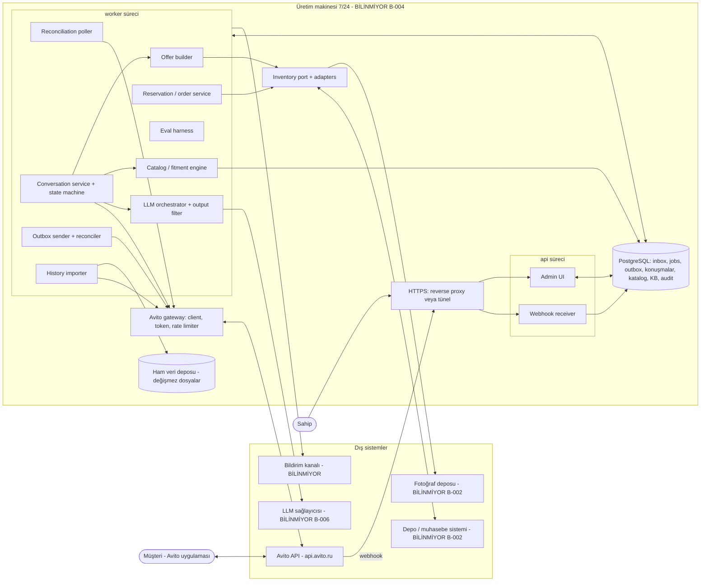
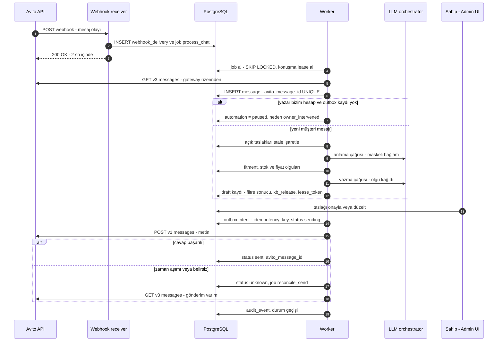
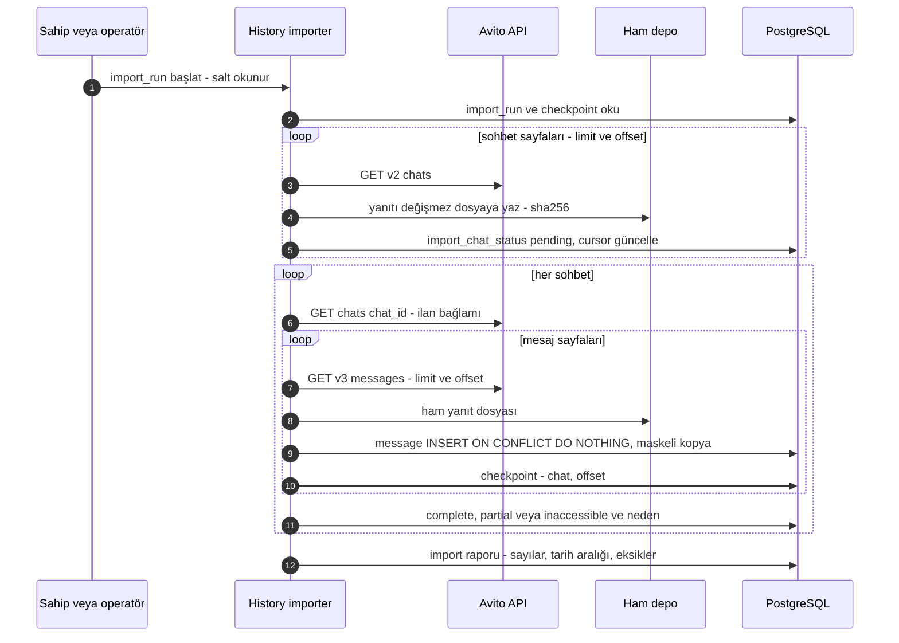
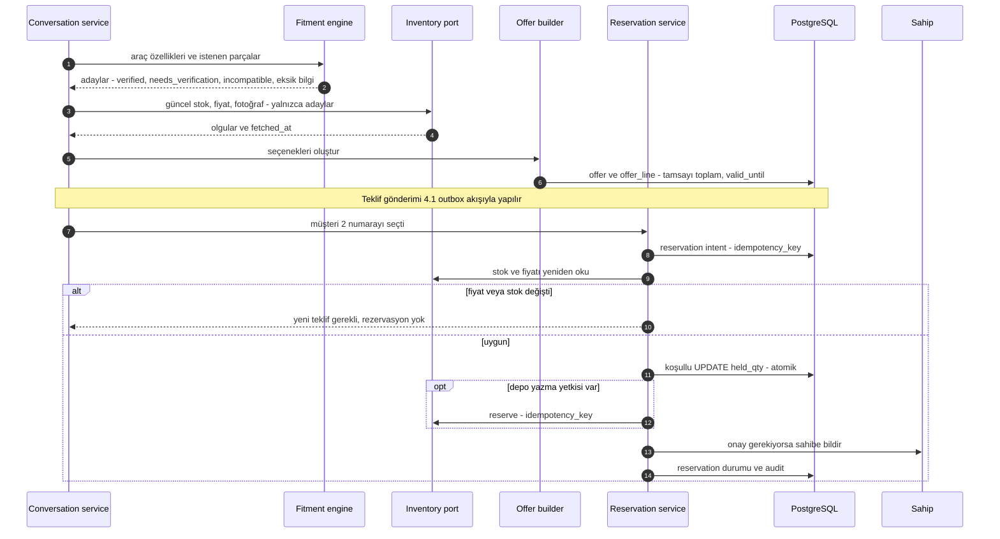
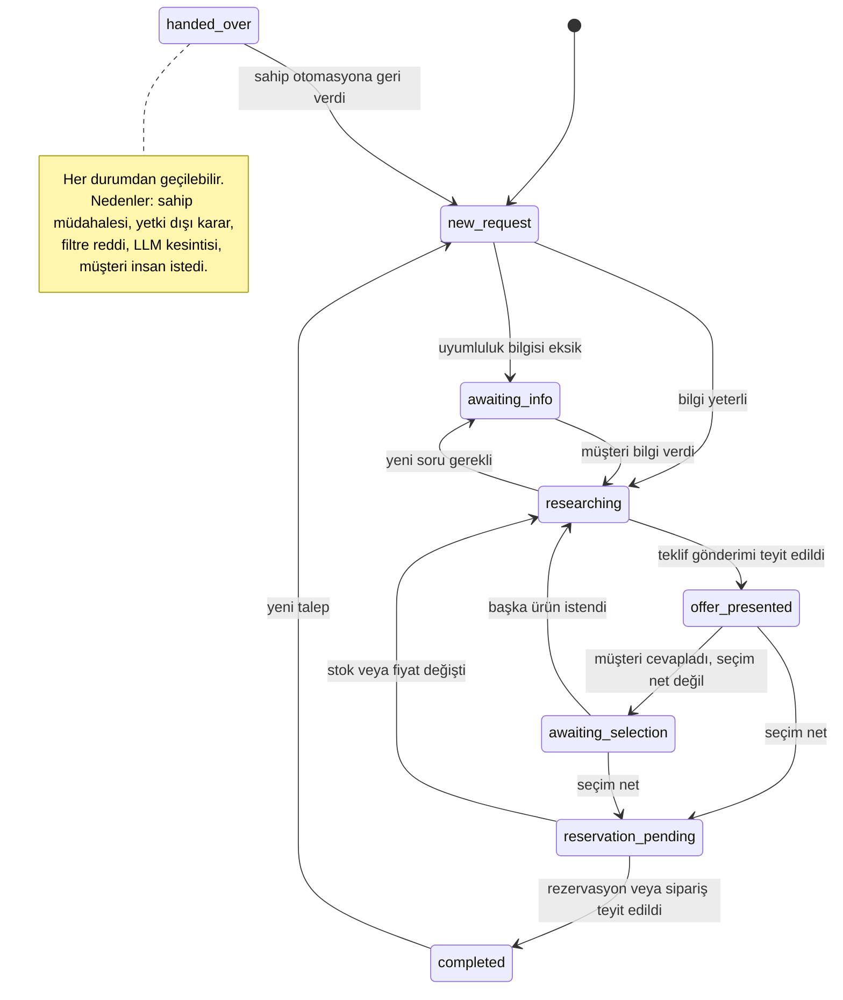
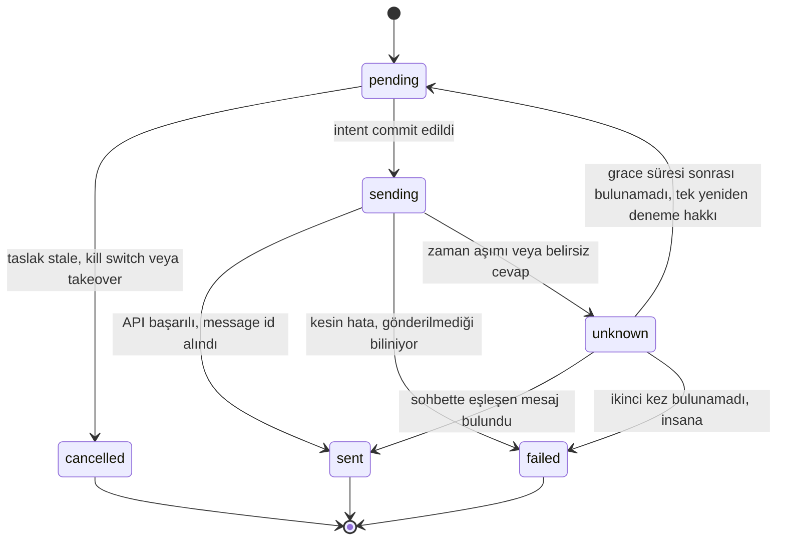
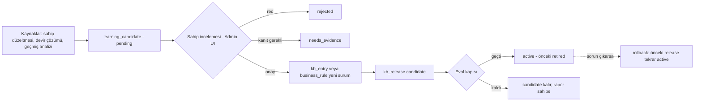
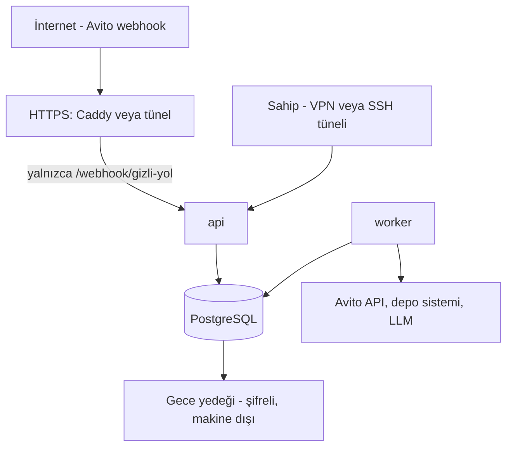

# ARCHITECTURE — Mimari ve veri akışları

> **TASLAK — Main Agent onayı bekliyor.** Hazırlayan: Mimari agent'ı (T-004), 2026-09-27.
> Bu belge somut, uygulanabilir bir mimari **önerisidir**. Bilinmeyene bağlı her parça "BİLİNMİYOR" ya da **keşif sonrası kesinleşecek (D-010)** diye işaretlidir ve [../BLOCKERS.md](../BLOCKERS.md) kimliğine bağlıdır. Belgenin önerdiği kararlar §15'te ÖK-n olarak listelenir. Onaylananlar [DECISIONS.md](DECISIONS.md)'ye D-numarasıyla işlenir.

Kaynaklar: gereksinimler [OWNER_REQUEST_2026-09-27.md](OWNER_REQUEST_2026-09-27.md) ve [PROJECT_BRIEF.md](PROJECT_BRIEF.md); kararlar [DECISIONS.md](DECISIONS.md); aşamalar [PLAN.md](PLAN.md). Avito ile ilgili olgular T-002'den gelir (`tasks/T-002/report.md`). Bunlar resmî OpenAPI spec kopyalarına dayanır ve canlı doğrulanmamıştır. Ortamla ilgili olgular T-001'den gelir (`tasks/T-001/report.md`).

## 1. Temel ilkeler

1. **Tek makinede çalışan modüler monolit.** Üç süreç çalışır: `api`, `worker` ve PostgreSQL. Önlerinde bir HTTPS katmanı (reverse proxy veya tünel) bulunur. Mikroservis, ayrı mesaj kuyruğu sunucusu ya da Kubernetes yoktur. Tek bir VPS veya sürekli açık bir PC yeter.
2. **LLM yalnızca dil işi yapar:** mesajı anlamak (yapılandırılmış çıkarım) ve cevap metnini yazmak. Fiyat, toplam, stok, uyumluluk kararı, durum geçişi, rezervasyon ve gönderim **deterministik koddadır**. LLM hiçbir yazma aracını çağıramaz.
3. **Önce niyet, sonra dış etki.** Dışarıyı etkileyen her işlem şu sırayla yürür: niyet kaydı (idempotency key ile), işlem, sonuç kaydı. Sonuç belirsiz kalırsa yeniden denemeden önce gerçek durum sorgulanır ([../AGENTS.md](../AGENTS.md) §6).
4. **Portlar ve adaptörler.** Avito, depo/muhasebe, fotoğraf deposu, LLM sağlayıcısı, bildirim kanalı ve yedek hedefi birer arayüzün arkasındadır. Bilinmeyen her sistem için önce bir **sentetik** adaptör yazılır. Sentetik adaptör açıkça etiketlidir; gerçek adaptör geldiğinde değiştirilebilir.
5. **Taslak modu varsayılandır** (D-006). Gönderim, `automation_mode` ayarı ve sahibin verdiği yetki kapsamıyla açılır.
6. **Webhook bir tetikleyicidir; doğruluk kaynağı API'dir.** Webhook yükü yalnızca "şu sohbette yenilik var" sinyali olarak kullanılır. İçerik her zaman API'den okunur. Webhook hiç gelmese bile poller ile sistem çalışmaya devam eder.

## 2. Bağlam ve bileşen diyagramı

`api` süreci yalnızca HTTP'ye cevap verir: webhook alır ve yönetim ekranını sunar. Dış API çağrısı ve LLM çağrısı yapmaz. Bu sayede webhook'a 2 saniye içinde 200 dönmek garanti altında kalır. Tüm uzun işler `worker` sürecinde, PostgreSQL üzerindeki kalıcı iş kuyruğundan (`job` tablosu) yürür.

## 3. Bileşenler ve sorumluluklar

| Bileşen | Sorumluluk | Notlar |
|---|---|---|
| **Avito gateway** | Spec'ten yazılmış kendi ince istemcimiz. Kapsadığı uç noktalar: chats listesi/detayı, v3 messages, v1 text send, uploadImages, messages/image, read, webhook kaydı. Token yönetimi, uç nokta grubuna göre rate limiter, hata sınıflandırması: `retryable`, `auth`, `rate_limited`, `ambiguous`, `permanent`. | Spec dışı uç nokta eklenmez. Mesaj silme ve blacklist yalnızca sahibin yönetim ekranından elle yaptığı işlemler olarak açılır; otomasyon ve LLM bunlara erişemez. |
| **Webhook receiver** | Gövdeyi `webhook_delivery` tablosuna yazar, `process_chat` işi ekler, commit eder ve 200 döner. | Gövde boyutu sınırlıdır. URL yolunda gizli bir token bulunur (imza algoritması yayımlanmadığı için). Ayrıştırma hatası olsa bile yük saklanır ve 200 dönülür. |
| **Reconciliation poller** | Periyodik olarak sohbet listesini ve son mesajları çeker, kaçan webhook'ları yakalar. Aynı dedup yolunu kullanır. | Süre yapılandırılabilir (ör. 2–5 dk). Webhook kurulamazsa **tek alım yolu** olur (§12). |
| **Conversation service** | Konuşma durum makinesi (§4.4), konuşma kilidi/lease, bağlam derleme, taslak üretimini tetikleme, eski taslakları geçersiz kılma, sahip müdahalesini algılama. | Durum geçişleri yalnızca bu serviste ve doğrulanmış olaylarla olur. |
| **Inventory port** | `search_products`, `get_stock`, `get_price`, `get_photos`, `health`. İsteğe bağlı yazma yetenekleri: `reserve`, `release`, `create_order` (yetenek bayraklarıyla). | Adaptörler: `SyntheticInventoryAdapter` yalnızca geliştirme içindir. Kayıtlarında `data_origin=synthetic` ve `SYN-` önekli SKU bulunur; `APP_ENV=production` iken başlamayı reddeder. Gerçek adaptör T-007 sonrası yazılır (API/DB/dosya aktarımı: BİLİNMİYOR, B-002). Önce salt okunur çalışır. |
| **Catalog / fitment engine** | Ürün modeli (§5), set/parça ilişkileri, araç özellikleri, uyumluluk değerlendirmesi. Çıktısı ürün başına `verified` / `needs_verification` / `incompatible` durumu, kanıt, kaynak ve eksik bilgi listesidir. | Deterministiktir. Görsel benzerlik, LLM çıktısı, müşteri beyanı ve "W213" tek başına kanıt türü **değildir**: şema bu kanıt türlerini içermez. |
| **Offer builder** | Numaralı seçenekler (1, 2, 3). Satır fiyatları ve toplam tamsayı minor unit ile hesaplanır (RUB için копейка). Set kapsamı, uyumluluk durumu ve yalnızca stok kaydına bağlı fotoğraflar eklenir. Teklifin geçerlilik süresi ve stok kontrol zamanı kaydedilir. | İndirim yalnızca `business_rule` sınırı içinde uygulanır. Kurallar BİLİNMİYOR (B-005); kural yoksa indirim yoktur. |
| **Reservation / order service** | Rezervasyon ve sipariş niyeti, yerel atomik tutma (hold), depoda yeniden kontrol, harici yazma (yetki varsa), sipariş durumu ile ödeme durumunun ayrı tutulması. | §6.7'ye bakın. |
| **LLM orchestrator** | Sağlayıcı soyutlaması, yapılandırılmış çıktılar (JSON şema), olgu kağıdı (fact sheet) ile grounding, araç allowlist'i, maliyet sayacı ve devre kesici. | §3.1'e bakın. |
| **Output filter** | Gönderilecek her metin için kural tabanlı son kontrol: iletişim bilgisi, platform dışı ödeme, doğrulanmamış vaat, onaysız "tamamlandı" iddiası, olgu kağıdında olmayan sayılar, 1000 karakter sınırı. | Başarısız taslak insana gider. |
| **PII masker** | Telefon, e-posta, sosyal medya hesabı, adres ve kart numarası benzeri desenleri yer tutucuyla değiştirir. LLM girdisine, normalize kopyaya ve loglara uygulanır. | Ham veri maskelenmez, ancak yalnızca ham depoda durur. |
| **KB + learning** | Sürümlü bilgi girdileri, işletme kuralları, sürümler (`kb_release`), öğrenme adayları ve onay akışı. | §9'a bakın. |
| **Eval harness** | Sabit senaryolar (W213 dahil) üzerinde deterministik kontroller ve sürüm kapısı. | §9.3'e bakın. |
| **History importer** | API öncelikli, kaldığı yerden devam eden, tekrarsız geçmiş aktarımı. Ham veri değişmez biçimde, normalize kopya maskeli olarak saklanır. Sonunda rapor üretir. | §8'e bakın. Önce derinlik ölçüm betiği çalışır. |
| **Admin UI** | Sahip için Türkçe, teknik bilgi gerektirmeyen ekranlar (§11). | Sunucu tarafında üretilen sayfalar. |
| **Audit log** | Yalnızca eklemeye açık (append-only) `audit_event` tablosu. | Biçim [../AGENTS.md](../AGENTS.md) §7'deki gibidir. |
| **Kill switch / takeover** | Global `kill_switch` ve `automation_mode`; konuşma bazında `automation=paused`. | Outbox sender her gönderimden hemen önce kontrol eder (§6.10). |
| **Notifier** | Uyarıları sahibe iletir (port). | Kanal BİLİNMİYOR. Yönetim ekranındaki uyarı bandı her durumda gösterilir. |

### 3.1 LLM orchestrator — bir mesaj turu

1. **Bağlam derleme (kod):** Yalnızca bu konuşmanın mesajları (maskeli, son N mesaj ve özet), ilan bağlamı ve konuşma durumu toplanır. Başka konuşmalardan veri **yüklenmez**; sorgular `conversation_id` ile sınırlanır.
2. **Anlama çağrısı (LLM, JSON şema):** Çıktı alanları: `language`, `intents[]`, `vehicle` (make, model, chassis_code, year, facelift, equipment{}), `requested_parts[]`, `selection` (seçenek numarası), `asks_if_bot`, `wants_human`, `sentiment_flags`. Şemaya uymayan çıktı reddedilir; bir kez yeniden denenir, sonra insana gider.
3. **Karar (kod):** Durum makinesi ve politika motoru bir sonraki eylemi seçer: `ask_info`, `search_and_offer`, `answer_faq`, `confirm_selection`, `reserve`, `bot_disclosure`, `handover`. Eksik uyumluluk bilgisi fitment engine'in `missing_attributes` çıktısından gelir.
4. **Olgu kağıdı (kod):** Eylem için gereken olgular kimlikleriyle toplanır: `F-12: product SKU…, price 1250000 minor RUB, source=inventory, fetched_at=…, priority=1`. Öncelik kuralı §9.1'de uygulanır.
5. **Yazma çağrısı (LLM, JSON şema):** Girdi olgu kağıdı, eylem, üslup örnekleri (onaylı, maskeli) ve müşterinin dilidir. Çıktı: `reply_parts[]`, `used_fact_ids[]`, `claims[]` (ör. `{type: price, fact_id: F-12}`). Fiyat ve toplamlar metne LLM tarafından yazılmaz; `{{F-12.price}}` gibi yer tutucularla kod tarafından yerleştirilir.
6. **Doğrulama (kod):** Output filter çalışır ve her `claim` olgu kağıdıyla eşlenir. Metindeki sayılar olgulardakilerle karşılaştırılır. Sonuç `draft` olarak saklanır.

**Araç allowlist'i:** Varsayılan tasarımda LLM'e araç verilmez; bilgi, olgu kağıdı olarak kod tarafından sağlanır. İleride yalnızca salt okunur iki araç açılabilir: `kb_search` ve `catalog_search`. Bu araçlara `conversation_id` ve izinli kapsam parametresi sunucu tarafından enjekte edilir; LLM bunları değiştiremez. Yazma, gönderim, silme, blacklist ve rezervasyon hiçbir zaman araç olarak sunulmaz.

**Sağlayıcı soyutlaması:** `LLMProvider.generate_structured(purpose, schema, messages, limits) -> (result, usage)`. Adaptörler yurt dışı API, Rusya'da barındırılan API veya kendi barındırılan model olabilir (§7.5; seçim B-006). Her çağrı `llm_usage` tablosuna yazılır. Model ve prompt sürümü taslakla birlikte kaydedilir.

## 4. Veri akışları

### 4.1 Yeni mesaj: webhook → inbox → işleme → taslak/onay → outbox → gönderim → teyit

- **Taslak modu (`draft_only`):** Akış taslak kaydında durur. Sahip taslağı yönetim ekranında görür ve isterse kopyalayıp kendisi gönderir. Bu elle gönderim otomasyonu duraklatır; bu davranış bilinçlidir.
- **Onayla gönder (`approve_to_send`):** Sahibin onayı outbox kaydı oluşturur.
- **Kapsamlı otomatik (`auto_scoped`):** Yalnızca DECISIONS'daki "Verilen canlı yetkiler" tablosunda yazılı eylem türleri ve koşullar onaysız gider (ör. yalnızca `ask_info`). Kapsam `automation_scope` yapılandırmasındadır.
- **Okundu işareti:** v3 messages okuması sohbeti okundu yapmaz. `POST …/read` taslak modunda **hiç çağrılmaz**, böylece sahibin Avito'daki okunmamış göstergeleri bozulmaz. Canlı modda yalnızca bizim cevabımız teyit edildikten sonra çağrılır (ayarlanabilir).
- **Metin dışı gelen içerik** (ör. görsel): İlk sürümde insana devredilir. Tür değerleri uygulamada spec'ten alınır.

### 4.2 Geçmiş konuşma aktarımı

Ayrıntı §8'dedir. Aktarılan mesajlar `source=history_import` ile işaretlenir ve **cevap üretimini tetiklemez**.

### 4.3 Teklif → rezervasyon / sipariş

Müşteriye "ayrıldı" veya "sipariş oluşturuldu" mesajı yalnızca ilgili kayıt `confirmed` olduktan sonra, olgu kağıdında o kayıt varken yazılabilir (§7.2).

### 4.4 Konuşma durum makinesi (talep §7)

| Talep §7 durumu | Kod durumu |
|---|---|
| yeni talep | `new_request` |
| bilgi bekleniyor | `awaiting_info` |
| ürün araştırılıyor | `researching` |
| teklif sunuldu | `offer_presented` |
| seçim bekleniyor | `awaiting_selection` |
| rezervasyon/sipariş bekleniyor | `reservation_pending` |
| tamamlandı | `completed` |
| insana devredildi | `handed_over` |

Durumdan bağımsız iki alan daha tutulur: `automation` (`active` | `paused`) ve `paused_reason`. Durum geçişleri yalnızca **teyit edilmiş** olaylarla olur. Örneğin `offer_presented` durumuna, teklif mesajı outbox'ta `sent` olduktan sonra geçilir. Böylece durum, müşterinin gerçekten gördüğünü yansıtır.

### 4.5 Outbox kaydı durumları

## 5. Veri modeli

Tüm tablolar PostgreSQL'dedir. Zaman damgaları `timestamptz`, para tamsayı `*_minor` ve `currency` alanlarıyla tutulur. Dış kaynaktan gelen her olgu `source`, `source_ref` ve `fetched_at` / `verified_at` alanlarını taşır. Sentetik veriler `data_origin = 'synthetic'` alanıyla işaretlidir.

**Avito ve konuşma**

| Tablo | Anahtar alanlar | Kısıtlar / notlar |
|---|---|---|
| `webhook_delivery` | id, received_at, raw_body jsonb, parse_status, processed_at | Kısa saklama süresi; içeriği maskelenmez, erişimi kısıtlıdır. |
| `conversation` | id, avito_chat_id, avito_item_id, listing_id, state, automation, paused_reason, lease_owner, lease_until, lease_token, last_inbound_seq, language, customer_avito_id | `avito_chat_id` UNIQUE. `lease_token` her lease alımında artar (fencing). |
| `message` | id, avito_message_id, conversation_id, seq, author_role (`customer`/`assistant`/`owner_manual`/`unknown`), author_avito_id, created_at_avito, type, content_masked, raw_ref, source (`webhook`/`poller`/`history_import`/`browser_export`), outbound_id | `avito_message_id` UNIQUE, **dedup anahtarı**. Kaynakta olmayan alan boş kalır, uydurulmaz. |
| `listing` | avito_item_id, title, price_string, url, fetched_at | Avito'nun ilan bağlamıdır. İlan fiyatı yetkili fiyat **değildir**. |
| `listing_product_link` | listing_id, product_id, match_status (`confirmed`/`candidate`/`rejected`), evidence_type (`autoload_id`/`owner_confirmed`/…), confirmed_by, confirmed_at | `candidate` bağlantı kesin eşleşme gibi kullanılmaz. |

**Kuyruk, taslak, outbox**

| Tablo | Anahtar alanlar | Kısıtlar / notlar |
|---|---|---|
| `job` | id, kind, dedup_key, payload, status (`queued`/`running`/`done`/`dead`), run_after, attempts, max_attempts, locked_by, locked_until, last_error_code | Kısmi UNIQUE (kind, dedup_key) WHERE status IN (queued, running): aynı sohbet için tek bekleyen iş. |
| `draft` | id, conversation_id, based_on_seq, lease_token, action, parts, used_fact_ids, fact_sheet jsonb, kb_release_id, prompt_version, model_id, filter_result, status (`proposed`/`approved`/`edited`/`rejected`/`stale`/`sent`), owner_edit, reviewed_at | Sahip düzeltmesi (`owner_edit`), öğrenme adayı kaynağıdır. |
| `outbound_message` | id, idempotency_key, conversation_id, draft_id, part_no, kind (`text`/`image`), body_text veya photo_id, text_hash, status (§4.5), intent_at, attempts, avito_message_id, confirmed_at, last_error_code | `idempotency_key` UNIQUE = hash(draft_id, part_no). `avito_message_id` UNIQUE. |
| `photo_upload` | outbound_id, photo_id, avito_image_id, uploaded_at | `image_id` yeniden kullanılabilir mi, BİLİNMİYOR; doğrulanana kadar her gönderimde yeniden yüklenir. |

**Katalog ve stok** (gerçek alanlar B-002'ye göre uyarlanır)

| Tablo | Anahtar alanlar | Kısıtlar / notlar |
|---|---|---|
| `product` | id, sku, oem_numbers[], brand, part_type, title, condition (`new`/`used`), color, condition_notes, is_set, data_origin, source, source_ref, last_verified_at | (source, sku) UNIQUE |
| `set_component` | set_product_id, component_product_id veya component_desc, qty, present | Setteki eksik parçalar `present=false` olarak tutulur. |
| `vehicle_spec` | id, make, model, chassis_code, year_from, year_to, facelift (`pre`/`post`/`unknown`), notes | Örnek: Mercedes, E-Class, W213 |
| `fitment` | product_id, vehicle_spec_id, conditions jsonb (donanım, paket, sensör, kamera, bağlantı gereksinimleri), status (`verified`/`needs_verification`/`incompatible`), evidence_type, evidence_ref, source, verified_by, verified_at | CHECK: `verified` durumu, izinli `evidence_type` (ör. `oem_catalog`, `manufacturer_doc`, `owner_confirmed`) ve dolu `evidence_ref` gerektirir. Görsel, LLM ve müşteri beyanı izinli kanıt türü değildir. |
| `inventory_item` | id, product_id, location, physical_qty, external_reserved_qty, available_qty, held_qty (bizim yerel tutmalarımız), source, fetched_at | Koşullu UPDATE ile atomik tutma yapılır (§6.7). |
| `price` | product_id, amount_minor, currency, source, fetched_at, verified_at | Yetkili kaynak yalnızca inventory port'tur. |
| `photo` | id, product_id, inventory_item_id, storage_uri, sha256, source, verified_at, data_origin | Yalnızca stok kaydına bağlı gerçek fotoğraflar tutulur. |

**Ticari**

| Tablo | Anahtar alanlar | Kısıtlar / notlar |
|---|---|---|
| `offer` | id, conversation_id, draft_id, currency, total_minor, inventory_checked_at, valid_until, status (`draft`/`presented`/`superseded`/`expired`/`accepted`) | Toplam = Σ satır toplamı, kodda hesaplanır ve test edilir. |
| `offer_line` | offer_id, option_no, product_id, qty, unit_price_minor, line_total_minor, fitment_status, fitment_ref, set_summary, photo_ids[] | (offer_id, option_no) UNIQUE |
| `reservation` | id, idempotency_key, offer_line_id, inventory_item_id, qty, status (`requested`/`held_local`/`confirmed_external`/`released`/`expired`/`failed`), expires_at, external_ref, verified_at | `idempotency_key` UNIQUE = hash(conversation, offer_line) |
| `sales_order` | id, idempotency_key, conversation_id, total_minor, status (`draft`/`pending_owner`/`created_external`/`cancelled`/`fulfilled`), payment_status (`not_requested`/`pending`/`confirmed`), external_ref, verified_at | Sipariş durumu ile ödeme durumu ayrı alanlardır (talep §7). |

**Bilgi, öğrenme, değerlendirme**

| Tablo | Anahtar alanlar | Kısıtlar / notlar |
|---|---|---|
| `business_rule` | key, version, value jsonb (tipli), critical, approved_by, approved_at, effective_from | Kritik kurallar (fiyat, indirim, garanti, iade, uyumluluk politikası) yalnızca sahibin yönetim ekranı eylemiyle değişir. |
| `kb_entry` | entry_key, version, kind (`faq`/`product_note`/`policy_text`/`style_example`), body_masked, priority_level (2–5), source_refs, status, approved_by, approved_at | (entry_key, version) UNIQUE; eski sürümler silinmez. |
| `kb_release` | id, entry_versions[], rule_versions[], prompt_version, eval_run_id, status (`candidate`/`active`/`retired`), activated_at | Tek `active` kayıt (kısmi UNIQUE). Rollback, önceki kaydı tekrar etkinleştirmektir. |
| `learning_candidate` | id, kind, proposed_change, evidence_refs, origin (`owner_correction`/`handover_resolution`/`history_analysis`/`customer_statement`/`assistant_output`), critical, status (`pending`/`approved`/`rejected`/`needs_evidence`), reviewed_at, result_entry_version | `customer_statement` ve `assistant_output` tek başına onaylanabilir kanıt değildir. |
| `interaction_record` | conversation_id, intents, fact_ids, draft_id, outbound_ids, kb_release_id, action, action_result, handover_reason, owner_correction_ref, learning_candidate_ids | Talep §8'deki kayıt. |
| `eval_run` | id, kb_release_id, prompt_version, model_id, scenario_set_version, results jsonb, passed, started_at, finished_at | Senaryolar `tests/` altında sentetiktir ve PII içermez. |

**İşletim**

| Tablo | Anahtar alanlar | Kısıtlar / notlar |
|---|---|---|
| `audit_event` | id, ts, op_id, correlation_id, actor (`system`/`owner`/`job:<kind>`), action, sources jsonb (kimlikler), reason_code, reason_short (≤200 karakter), result, kb_release_id, prompt_version | Uygulama DB rolünde UPDATE/DELETE yetkisi yoktur. Düşünce zinciri, gizli değer, ham mesaj metni ve iletişim bilgisi yazılmaz; yalnızca kimlikler tutulur. |
| `system_setting` | kill_switch, automation_mode, automation_scope, set_by, set_at, reason | Her değişiklik audit'e yazılır. |
| `llm_usage` | ts, provider, model, purpose, conversation_id, input_tokens, output_tokens, cost_minor, ok | Maliyet ekranı ve bütçe sınırı bu tablodan beslenir. |
| `import_run`, `import_chat_status` | run_id, avito_chat_id, status (`pending`/`complete`/`partial`/`inaccessible`/`error`), cursor, messages_fetched, oldest_at, newest_at, reason | Kaldığı yerden devam bu tabloyla yapılır. |
| `raw_blob` | sha256, path, run_id, kind, fetched_at | Ham dosya dizinidir; dosyanın kendisi DB dışındadır. |
| `health_status` | component, status, checked_at, detail | Yönetim ekranı ve uyarılar için kullanılır. |

## 6. Güvenilirlik

### 6.1 Kalıcı kuyruk ve yeniden deneme
- Kuyruk PostgreSQL'deki `job` tablosudur. İşler `SELECT … FOR UPDATE SKIP LOCKED` ile alınır. `locked_until` süresi dolan iş (çökmüş worker) yeniden alınabilir.
- Geri çekilme süreleri üstel ve jitter'lıdır: 10 sn, 30 sn, 2 dk, 10 dk, 1 sa. `max_attempts` aşılırsa iş `dead` olur, yönetim ekranında "Hatalar" listesine düşer ve uyarı gönderilir.
- **Yan etkisiz** işler (okuma, taslak üretimi) otomatik yeniden denenir. **Yan etkili** işler (gönderim, rezervasyon, sipariş) belirsiz sonuçta yeniden denenmez; önce uzlaştırma yapılır (§6.5).

### 6.2 Tekrar önleme
- Gelen mesajlarda `message.avito_message_id` UNIQUE'tir ve `INSERT … ON CONFLICT DO NOTHING` kullanılır. Webhook, poller ve geçmiş aktarımı aynı yolu kullanır.
- Bir iş, yalnızca yeni eklenen müşteri mesajı varsa taslak üretir. Aynı mesaj ikinci kez gelirse yeni satır oluşmaz, dolayısıyla yeni taslak da oluşmaz.
- Gidenlerde `idempotency_key`, rezervasyonda `reservation.idempotency_key`, siparişte `sales_order.idempotency_key` kullanılır.
- Avito'nun gönderim uç noktası için idempotency anahtarı desteği spec'te yok. Bu yüzden sunucu tarafı tekilleştirmeye güvenilmez; §6.5 geçerlidir.

### 6.3 Konuşma başına tek cevaplayıcı
- `job` tablosunda sohbet başına tek bekleyen `process_chat` işi bulunur (kısmi UNIQUE). Yeni olay, mevcut işe eklenir.
- İşi alan worker şu koşullu UPDATE ile lease alır: `UPDATE conversation SET lease_owner=…, lease_until=now()+90s, lease_token=lease_token+1 WHERE id=… AND (lease_until < now() OR lease_owner IS NULL)`. LLM çağrıları uzun sürebileceğinden işlem sırasında DB transaction'ı açık tutulmaz; lease süresi heartbeat ile uzatılır.
- Taslak, `lease_token` değeriyle yazılır. Onay ve gönderim anında token karşılaştırılır; eski token taşıyan taslak reddedilir (fencing).

### 6.4 Yeni mesaj gelince eski taslağın yeniden doğrulanması
- Taslak, `based_on_seq` alanını taşır. Onayda ve outbox'a geçişte aynı transaction içinde `conversation.last_inbound_seq = draft.based_on_seq` koşulu aranır. Koşul tutmazsa taslak `stale` olur ve sohbet için yeni `process_chat` işi açılır.
- Teklif içeren taslakta ayrıca `offer.valid_until` ve `inventory_checked_at` kontrol edilir. Süre dolmuşsa stok ve fiyat yeniden okunur; değişiklik varsa taslak yeniden üretilir.
- Yeni müşteri mesajı geldiğinde `pending` durumundaki outbox kayıtları `cancelled` olur. `sending` durumundakilere dokunulmaz.

### 6.5 Outbox ve belirsiz gönderim sonucu
1. **Intent:** Outbox satırı `sending` durumuna geçirilir; `intent_at` ve `attempts+1` aynı transaction'da commit edilir. Kill switch ve takeover kontrolü de bu transaction'ın içindedir.
2. **Gönderim:** `POST /messenger/v1/…/messages` çağrılır (metin, en fazla 1000 karakter; kod, uzun metni anlamlı parçalara böler).
3. **Başarılı cevap:** Satır `sent` olur ve dönen mesaj kimliği kaydedilir. Cevap 4xx ise ve gönderilmediği açıksa satır `failed` olur ve insana gider. 401 durumunda token yenilenir ve bir kez tekrar denenir; 401 cevabı mesajın gönderilmediğini gösterir.
4. **Belirsiz sonuç** (zaman aşımı, bağlantı kopması, 5xx): Satır `unknown` olur ve `reconcile_send` işi açılır. Bu iş sohbetin son mesajlarını v3 messages ile okur. Yazarı bizim hesabımız olan, `created ≥ intent_at − tolerans` koşulunu sağlayan ve normalize metni `text_hash` ile eşleşen bir mesaj arar. Bulursa satır `sent` olur.
5. Mesaj bulunamazsa bir grace süresi (ör. 2 × 60 sn) sonra bir kez daha bakılır. Yine yoksa **yalnızca bir** otomatik yeniden gönderim yapılır (aynı `idempotency_key`, yeni attempt). İkinci belirsizlikte satır `failed` olur ve sahibe bildirilir. Aynı mesajın ikinci kez görünme riski düşük ama sıfır değildir; bu risk açıkça kabul edilir ve eval/test ile ölçülür.
6. Görsel mesajlarda da aynı model geçerlidir. Eşleştirmede metin yerine tür ve zaman kullanılır. uploadImages ile yükleme yan etkisizdir (müşteriye görünmez) ve serbestçe tekrarlanabilir.

### 6.6 Sahip müdahalesinin algılanması
- Yazarı bizim hesabımız (`author_id == user_id`) olup `outbound_message` içinde karşılığı bulunmayan mesaj **sahip müdahalesi** sayılır. Karşılık aranırken `sending`/`unknown` satırlar da metin ve zaman penceresiyle eşleştirilir. Bu, kendi gönderimimizin webhook'u cevaptan önce gelirse yanlış alarm çıkmasını önler.
- Müdahale algılanınca `automation=paused`, `paused_reason=owner_intervened` yapılır, bekleyen taslaklar ve outbox kayıtları iptal edilir ve audit yazılır. Otomasyon ancak sahip yönetim ekranında "asistana geri ver" dediğinde döner.
- Avito'nun yerleşik **Автоответы** özelliği de bizim hesabımızdan mesaj üretir. Bu özellik hem çift cevaba yol açar hem de her seferinde yanlış "müdahale" algılatır. Canlı modda kapatılması önerilir (sahip kararı; Sorular'a bakın).

### 6.7 Son ürünün iki müşteriye ayrılmasını önleme
- **Yerel garanti:** Rezervasyon tek bir koşullu UPDATE ile yapılır: `UPDATE inventory_item SET held_qty = held_qty + :q WHERE id = :id AND available_qty - held_qty >= :q RETURNING id`. Satır dönmezse ürün tükenmiştir. Aynı son ürün için gelen iki eşzamanlı talepten yalnızca biri başarılı olur. Bu durum eşzamanlı testle doğrulanır.
- **Yeniden kontrol:** Tutmadan hemen önce inventory port'tan canlı stok ve fiyat okunur ve `available_qty` güncellenir. Tutma bunun ardından yapılır.
- **Harici yazma:** Depo sistemi rezervasyon yazmayı destekliyorsa ve yetki verilmişse, `idempotency_key` ile (sistem destekliyorsa) harici rezervasyon yapılır. Rezervasyon ancak sonuç doğrulandıktan sonra `confirmed_external` olur.
- **Garanti edilmeyen:** Depo sistemi dışarıda olduğu için tezgâh satışı, başka bir kanal veya elle düzeltme, bizim okumamız ile tutmamız arasında aynı parçayı satabilir. Harici yazma desteği yoksa rezervasyon yalnızca **asistan içi bir tutmadır**. Bu durumda müşteriye "ayırdık" denmez; sahibin belirleyeceği ifade kullanılır (ör. "satıcı teyit edecek"). Son onayı sahip verir (B-005).
- Tutmalar `expires_at` ile düşer; süre işletme kuralıdır (B-005). Süresi dolan tutmayı periyodik bir iş serbest bırakır.

### 6.8 Yeniden başlatma sonrası toparlanma
- Açılışta şu adımlar sırayla yürür: (1) DB migration kontrolü; (2) `sending` satırları `unknown` yapılıp uzlaştırılır; (3) süresi dolan lease ve job kilitleri serbest bırakılır; (4) poller, son başarılı çalışmadan bu yana kaçan mesajları tarar; (5) outbox gönderimi ancak uzlaştırma bittikten sonra açılır.
- Yedekten geri yüklemede sistem `kill_switch=on` ile başlar. Sahip, uzlaştırma raporunu gördükten sonra açar.

### 6.9 Oturum ve token süresi
- `TokenManager`, `client_credentials` ile token alır ve token'ı yalnızca bellekte tutar (DB'ye ya da loglara yazmaz). `expires_in − güvenlik payı` dolmadan yeniler. 401 alınırsa tek seferlik yenileme yapar; üst üste 401 gelirse `auth` hatası üretir, gönderimleri durdurur ve uyarı gönderir.
- Kimlik bilgileri ortam değişkenlerinden veya gizli dosyadan okunur (`AVITO_CLIENT_ID`, `AVITO_CLIENT_SECRET`; yalnızca adlar). Messenger erişimi «Максимальный» aboneliğine bağlıdır. Abonelik düşerse 401/403 hataları `auth` olarak sınıflanır ve sağlık ekranında görünür.

### 6.10 LLM kesintisi, hız ve maliyet sınırları
- LLM çağrısı hata verirse veya zaman aşımına uğrarsa: devre kesici açılır, sohbet `handed_over` (`paused_reason=llm_unavailable`) olur, sahibe bildirim gider. **Otomatik cevap gönderilmez.** Şablon "bekleme mesajı" yalnızca sahip ayrıca onaylarsa açılır.
- Avito rate limiter uç nokta grubu başına token bucket kullanır. Items için 25/dk dokümante edilmiştir. Messenger limitleri dokümante değildir, bu yüzden muhafazakâr ve yapılandırılabilir bir varsayılan kullanılır. 429 alındığında geri çekilinir; `Retry-After` başlığı yalnızca varsa kullanılır.
- **Maliyet sınırları:** Günlük ve aylık LLM bütçesi (B-006), sohbet başına saatlik LLM çağrısı üst sınırı, sohbet başına saatlik otomatik mesaj üst sınırı (döngü koruması) ve global gönderim hızı uygulanır. Sınır aşılınca yeni taslak üretilmez ve konuşmalar insana gider.

### 6.11 Sağlık kontrolü ve uyarılar
- `/healthz` canlılık kontrolüdür. `/readyz` şunları denetler: DB, kuyruk gecikmesi, son webhook zamanı, son başarılı poller zamanı, token durumu, inventory `health()`, LLM devre kesicisi, disk doluluğu, son yedek yaşı.
- Uyarı tetikleyicileri: `dead` iş, `unknown` outbox, auth hatası, inventory bağlantısının kopması, poller'ın 3 periyottan uzun süre başarısız olması, bütçenin %80'i ve %100'ü, 24 saati aşan yedek yaşı. Uyarılar Notifier port'undan gönderilir (kanal BİLİNMİYOR) ve yönetim ekranında bant olarak gösterilir.
- **Stok bağlantısı koparsa** inventory olguları `unknown` olur. Yazma aşamasında "mevcut" iddiası yapılamaz; output filter, olgu kağıdında `priority=1` stok olgusu yoksa bu iddiayı reddeder.

### 6.12 Yedekleme ve geri yükleme
- Gece `pg_dump` (custom format) alınır ve ham veri dizini yedeklenir. Yedekler şifrelenmiş, tekilleştirilmiş (ör. restic) biçimde **makine dışı** bir hedefe gider (hedef BİLİNMİYOR; 152-FZ açısından konum önemlidir, §7.5). Saklama: 7 günlük, 4 haftalık, 6 aylık.
- Geri yükleme betiği boş bir makineye kurulum yapar ve `kill_switch=on` ile başlar (§6.8). Geri yükleme tatbikatı Aşama 9'da test edilir ve [TEST_REPORT.md](TEST_REPORT.md)'ye yazılır. Adımlar [RUNBOOK.md](RUNBOOK.md)'ye işlenir.
- Hedef RPO ≤ 24 sa; saatlik yedekle daha kısaltılabilir. Gönderilmiş mesajlar Avito'da durduğundan, geri yükleme sonrası uzlaştırma çift gönderimi önler.

### 6.13 Acil durdurma ve konuşma devralma
- **Global kill switch:** Yönetim ekranındaki tek düğmedir. Ayrıca `SENDING_HARD_DISABLED=1` ortam değişkeniyle de açılabilir; bu yol DB'ye ulaşılamadığında bile çalışır. Açıkken outbox gönderimi, harici rezervasyon/sipariş yazma ve okundu işaretleme durur. Mesaj alımı, taslak üretimi ve kayıtlar devam eder. Kontrol, gönderim çağrısından hemen önce intent transaction'ında yapılır.
- **Konuşma devralma:** Yönetim ekranında "Devral" düğmesi vardır; sahip müdahalesi otomatik de algılanır (§6.6). Devralınan konuşmanın bekleyen outbox kayıtları iptal edilir. Taslaklar yalnızca öneri olarak üretilebilir (ayarlanabilir).

## 7. Güvenlik

### 7.1 Talimat enjeksiyonu (D-009)
- Müşteri mesajı, ilan başlığı ve içe aktarılan veri LLM'e **veri bloğu** olarak ve açık sınırlayıcılarla verilir. Sistem talimatı bu içeriğin talimat olmadığını belirtir.
- Asıl koruma yapısaldır: LLM'in yazma aracı yoktur; bağlamda yalnızca o konuşmanın verisi bulunur; eylemi kod seçer; çıktı şemaya ve output filter'a tabidir. Enjeksiyon başarılı olsa bile yapabileceği en fazla şey kötü bir **taslak** üretmektir, ve bu taslak filtreden ve (canlı kapsam dışında) sahip onayından geçmek zorundadır.
- Eval setinde enjeksiyon senaryoları bulunur: "önceki talimatları unut", "başka müşterinin telefonunu ver", "indirimi %50 yap".

### 7.2 Output filter (gönderimden önceki son kapı)
Reddetme nedenleri şunlardır; her biri bir `reason_code` üretir ve taslak insana gider:
- İletişim bilgisi: telefon (RU biçimleri), e-posta, URL (izin listesi dışı), Telegram/WhatsApp/VK/@handle, "напишите в …" gibi yönlendirmeler. Avito Товары sohbetlerinde bu yasaktır ve hesabın engellenmesine yol açabilir.
- Platform dışı ödeme: kart numarası deseni, "переведите на карту", СБП/banka havalesi teklifi. İzinli ödeme ifadeleri işletme kuralıdır (B-005).
- Doğrulanmamış vaat: "точно подойдет", "гарантируем" gibi ifadeler, ilgili ürünün fitment olgusu `verified` değilse; kesin teslim tarihi, kural yoksa.
- Onaysız tamamlanma iddiası: "зарезервировано", "заказ оформлен", "оплата получена" gibi ifadeler, olgu kağıdında `confirmed` durumda rezervasyon, sipariş veya ödeme kaydı yoksa.
- Sayı tutarsızlığı: fiyat ve toplamlar olgu kağıdında olmayan değerlerse.
- Uzunluk: 1000 karakteri aşan parça.
- Kalıplar sürümlü yapılandırmada tutulur ve eval ile test edilir. Yeni bir hata türü bulununca kalıp eklenir ve bir test senaryosu yazılır (talep §8).

### 7.3 "Bot musun?" sorusu
Anlama çağrısı `asks_if_bot=true` döndürürse kod, sahibin onayladığı dürüst bir şablon kullanır (ör. satıcının otomatik asistanı olduğunu ve gerektiğinde satıcıya aktaracağını söyleyen metin; kesin metin sahip onayına tabidir). LLM'in bu soruyu inkâr eden bir cevap üretmesi filtre ve eval ile engellenir.

### 7.4 PII maskeleme
- Ham veri yalnızca ham depoda ve `webhook_delivery` tablosunda bulunur ve erişimi kısıtlıdır. Normalize kopyada, LLM girdisinde, loglarda, audit'te, KB'de ve eval'de PII yer tutucularla gösterilir: `<PHONE_1>`, `<EMAIL_1>`, `<NAME_1>`.
- Müşteri kimliği yalnızca Avito sayısal kimliği olarak tutulur. Konuşma içeriği Git'e ve Vault'a girmez (D-008).
- Maskeleme deterministik regex ile başlar. Ad ve adres tespiti için ek yöntem ileride değerlendirilir. Bu sınırlama açıkça belirtilir: serbest metindeki her kişisel veri yakalanamayabilir.

### 7.5 152-FZ seçenekleri (karar sahibindir; hukuki görüş değildir)

| Konu | Seçenek | Artı | Eksi |
|---|---|---|---|
| Barındırma | A) Rusya'da VPS | DB Rusya'da; statik IP ve gerçek HTTPS | Aylık ücret; sağlayıcı seçimi gerekir |
| | B) Sahibin Rusya'daki bilgisayarı | Ek maliyet yok; veri sahipte | Elektrik/internet kesintisi, uyku modu, dinamik IP; webhook için tünel gerekir |
| | C) Rusya dışında VPS | Kolay | 152-FZ yerelleştirme riski yüksek |
| LLM | 1) Yurt dışı API + PII maskeleme | Kalite ve kolaylık | Maskeli metin bile kişisel veri sayılabilir; sınır ötesi aktarım riski azalır ama sıfırlanmaz |
| | 2) Rusya'da barındırılan ticari LLM API'si | Aktarım riski daha düşük | Kalite, JSON şema desteği ve fiyat doğrulanmadı |
| | 3) Kendi barındırdığımız açık ağırlıklı model | Veri dışarı çıkmaz | Donanım/GPU maliyeti, kalite ve bakım yükü |
| Yedek hedefi | Rusya'da depolama / sahibin diski / yurt dışı bulut | — | Barındırma ile aynı değerlendirme |

Mimari bu seçeneklerin hepsini `LLMProvider` ve `BackupTarget` portlarıyla destekler. Seçim B-004 ve B-006 sahip cevaplarına bağlıdır.

## 8. Fotoğraflar

- **Kaynak:** Yalnızca `photo` kayıtları kullanılır. Bu kayıtlar inventory port'tan veya fotoğraf deposundan (B-002) gelir ve bir `product` / `inventory_item` kaydına bağlıdır. İlan fotoğrafları, başka stoktan gelen fotoğraflar ve yapay üretilmiş görseller satıştaki parçanın fotoğrafı olarak **kullanılmaz**. Sentetik adaptörün fotoğrafları "SYNTHETIC" filigranı taşır ve üretimde yüklenemez.
- **Gönderim:** Her fotoğraf ayrı bir outbox kaydıdır (`kind=image`). Önce `POST …/uploadImages` çağrılır (istek başına bir görsel, ≤24 MB; gerekirse kod küçültür), ardından `POST …/messages/image {image_id}`. Metin ve görsel sırası `part_no` ile korunur. Önce seçenek metni gider, sonra her seçeneğin fotoğrafı.
- **Fallback:** Bir ürünün fotoğrafı yoksa, dosyaya ulaşılamıyorsa veya yükleme başarısızsa teklif metni fotoğrafsız gider ve "bu parçanın fotoğrafı şu an yok" denir. Başka bir ürünün fotoğrafı asla kullanılmaz. Sahip isterse konuşma devralma için işaretlenir. Görsel gönderim yetkisi `automation_scope`'ta ayrı bir kalemdir.

## 9. Bilgi ve öğrenme

### 9.1 Bilgi öncelik sırası kodda (D-005)
Olgu kağıdındaki her olgu `priority` alanı taşır: 1 = inventory/sipariş sistemi, 2 = `business_rule`, 3 = `fitment` (`verified`), 4 = onaylı `kb_entry`, 5 = tarihsel örnek. `ContextAssembler` şu kuralları uygular:
- Aynı konu anahtarında (ör. `price:SKU`, `stock:SKU`, `rule:discount`) yalnızca en düşük numaralı (en yetkili) olgu tutulur.
- Fiyat, stok, rezervasyon ve sipariş olguları **yalnızca** 1. düzeyden gelebilir. Ek koşul olarak `fetched_at`, tazelik eşiği içinde olmalıdır. 1. düzey yoksa olgu `unknown` olarak eklenir; alt düzeylerden doldurulmaz.
- 5. düzey (tarihsel konuşmalar) yalnızca üslup örneği olarak kullanılır; olgu kağıdına fiyat, stok veya uyumluluk olgusu olarak **giremez**.
- İlan `price_string` değeri 1. düzey değildir. Depo fiyatıyla farklıysa sahibe uyarı gider; müşteriye depo fiyatı ya da hiç fiyat verilmez.

### 9.2 Öğrenme adayı → onay → sürüm → eval kapısı → rollback

- Öğrenme adayını onaylayan tek kişi sahiptir. Müşteri ifadesi ve asistanın kendi cevabı tek başına kanıt değildir (`origin` alanı).
- **Kritik kurallar** (fiyat, indirim, garanti, iade, uyumluluk) otomatik değişmez: `critical=true` olan aday toplu onayla kabul edilemez, ekranda ayrıca açık onay ister. `fitment` kaydını `verified` yapmak için izinli bir kanıt türü gerekir.
- Prompt ve model değişiklikleri de yeni bir `kb_release` (`prompt_version`, `model_id`) üretir ve aynı kapıdan geçer.

### 9.3 Eval harness
- Senaryolar `tests/` altında, sürümlü YAML dosyalarındadır ([../tests/README.md](../tests/README.md)). Sentetik ve maskelidirler. Her senaryo girdi konuşmasını, sentetik stok durumunu ve beklenen davranışı tanımlar.
- Çekirdek set:
  - W213 ön tampon + ızgara: doğru soruları sorma; `verified` ile `needs_verification` ayrımı; doğru toplam; yalnızca bağlı fotoğraflar.
  - Stok bağlantısı yokken "mevcut" dememe.
  - Fiyat belirsizken kesin fiyat vermeme.
  - İletişim bilgisi isteyen müşteri.
  - Enjeksiyon.
  - "Bot musun?" sorusu.
  - Son ürün.
  - Rusça, Türkçe ve diğer diller.
- Kontroller önce **deterministiktir**: yasak desen, sayı eşleşmesi, eylem türü, fitment iddiası. LLM hakem yalnızca üslup ve anlaşılırlık gibi ikincil puanlar için kullanılır.
- **Kapı kuralı:** Kritik kontroller %100 geçmelidir. Toplam puan, aktif sürümden tolerans kadardan fazla düşmemelidir. Sonuç `eval_run` tablosuna yazılır; sentetik ve gerçek sonuçlar [TEST_REPORT.md](TEST_REPORT.md)'de ayrı raporlanır.

### 9.4 KB'nin yeri
Doğruluk kaynağı DB'dedir (`kb_entry`, `business_rule`, `kb_release`). [../knowledge/](../knowledge/README.md) klasörüne, Obsidian'da okunabilmesi için her aktif sürümün PII içermeyen, salt okunur bir Markdown dökümü yazılır. Bu dosyalar elle düzenlenmez (D-008: Markdown işlem veritabanı değildir). Arama PostgreSQL tam metin arama (`russian` yapılandırması) ile başlar. Anlamsal arama (pgvector) yalnızca eval'de ölçülebilir fayda gösterirse eklenir.

## 10. Geçmiş konuşma aktarımı (ayrıntı)

1. **Önce derinlik ölçümü:** Salt okunur bir betik, örnek sohbetlerde API'den ulaşılabilen en eski mesaj tarihini, sayfa sayılarını ve hata/limit davranışını ölçer. Ayrıca okumanın okunmamış durumunu değiştirmediğini doğrular: aynı sohbet için `unread_only` listesine okumadan önce ve sonra bakılır. Sonuç, tam aktarımın kapsamını belirler.
2. **API öncelikli aktarım (§4.2):** `import_chat_status` ile checkpoint tutulur. Kesintiden sonra `cursor` noktasından devam edilir. Dedup `avito_message_id` ile yapılır. Rate limiter muhafazakâr çalışır. 429 veya auth hatasında iş durur ve bildirim gider.
3. **Ham depo:** API yanıtları değiştirilmeden dosyalara yazılır: `raw/avito/<run_id>/<kind>/<sha256>.json.zst`. Dosyalar tek yazımlık ve salt okunurdur; dizini `raw_blob` tablosudur. Ham depo Git ve Vault dışındadır.
4. **Normalize kopya:** `conversation`, `message` ve `listing` tablolarına maskeli içerik yazılır. Kaynakta olmayan alan boş kalır.
5. **İşaretleme:** Sohbet durumu `complete` / `partial` / `inaccessible` / `error` olarak ve `reason` alanıyla kaydedilir. Örnek nedenler: `api_depth_limit`, `forbidden`, `deleted`, `rate_limited_abort`. "Tüm mesajlar alındı" ifadesi yalnızca her sohbet `complete` ve derinlik sınırı yoksa kullanılır.
6. **Rapor:** Sohbet ve mesaj sayıları, en eski ve en yeni tarih, durum dağılımı, eksikler ve nedenleri, gözlenen yan etkiler raporlanır.
7. **Tarayıcı fallback'i:** Yalnızca API'nin ulaşamadığı eski geçmiş için kullanılır ve şu koşullara bağlıdır: tek seferliktir, sahibin açık onayıyla ve sahibin kendi makinesinde sahibin oturumuyla yapılır, salt okunurdur, yavaş ve kontrollü ilerler, giriş veya CAPTCHA görünce durur, çerez ya da şifre kaydetmez. Avito kullanım koşulları açısından risklidir (ikincil kaynak). Çıktısı aynı ham/normalize hattına `source=browser_export` ile girer. **Üretim yolunun parçası değildir.** 7/24 tarayıcı otomasyonu önerilmez (B-001).

## 11. Yönetim ekranı (talep §12)

Tek sahip kullanıcısı vardır. Arayüz Türkçedir ve sunucu tarafında üretilen sade sayfalardan oluşur. Oturum açma parolası hash'li saklanır.

| Talep §12 | Ekran |
|---|---|
| Aktif konuşmaları görme | "Konuşmalar" listesi: durum, son mesaj, bekleyen taslak, duraklatma nedeni |
| Hangi kaynakla cevap verildiği | Taslak detayı: olgu kağıdı (kaynak, `fetched_at`, öncelik), `kb_release`, filtre sonucu |
| Taslak onaylama/düzeltme | "Onayla ve gönder", "Düzelt", "Reddet". Düzeltme öğrenme adayı üretir. |
| Konuşmayı devralma | "Devral" ve "Asistana geri ver" |
| Otomasyonu durdurma/başlatma | Global kill switch ve mod seçimi (`draft_only` / `approve_to_send` / `auto_scoped`) |
| Stok bağlantısı sağlığı | "Sağlık" sayfası: inventory, Avito token/abonelik, webhook, poller, LLM, yedek |
| Hatalar ve öğrenme adayları | `dead` işler, `unknown` gönderimler, filtre retleri; "Öğrenme adayları" onay kuyruğu |
| Kullanım ve maliyet | Günlük/aylık LLM maliyeti, mesaj sayıları, taslak onay oranı |

Yönetim ekranı internete açılmaz: yalnızca VPN veya SSH tüneli üzerinden (ya da yerel ağdan) erişilir. İnternete açık tek yol webhook uç noktasıdır (§12).

## 12. Dağıtım topolojisi

**7/24 çalışması gerekenler:** HTTPS katmanı, `api`, `worker` ve PostgreSQL. Yedekleme zamanlanmış bir iştir. Makine uyku moduna girmemeli ve kesintiden sonra servisleri otomatik başlatmalıdır (`restart: unless-stopped` veya systemd).

| Seçenek | Webhook için HTTPS | Artı | Eksi |
|---|---|---|---|
| VPS + Caddy (otomatik TLS) | Alan adı → VPS IP, doğrudan | Sürekli açık, statik IP, basit | Aylık ücret; konum 152-FZ açısından önemli |
| Ev/ofis PC + tünel (Cloudflare Tunnel benzeri) | Tünel sağlayıcısının alt alan adı | Ek sunucu yok | Elektrik/internet kesintisinde kesinti. TLS tünel sağlayıcısında sonlanır, yani mesaj içeriği üçüncü taraftan geçer (152-FZ). Tünel hizmetinin Rusya'dan erişilebilirliği doğrulanmadı. |
| PC, webhook yok, yalnızca poller | Gerekmez | Açık port yok; en basit ve en güvenli yol | Cevap gecikmesi poll aralığı kadar olur (ör. 1–2 dk); API çağrı sayısı artar (rate limit bilinmiyor) |

Kod üç seçenekte de aynıdır; `WEBHOOK_ENABLED` ve `POLL_INTERVAL` yapılandırma ile belirlenir.

**Verinin yeri** (D-008):

| Veri | Yer | Git | Vault |
|---|---|---|---|
| Kod, belgeler, sentetik eval senaryoları, PII'siz KB dökümü | Depo | evet | evet (belgeler) |
| PostgreSQL verisi | `DATA_DIR/pg` (ör. `/var/lib/avito-assistant/pg`) | hayır | hayır |
| Ham Avito verisi | `DATA_DIR/raw` | hayır | hayır |
| Fotoğraf önbelleği | `DATA_DIR/photos-cache` | hayır | hayır |
| Gizli değerler | `CONFIG_DIR/secrets.env` (izin 600) | hayır | hayır |
| Yedekler | Makine dışı hedef (BİLİNMİYOR) | hayır | hayır |

Vault'ta yalnızca belgeler ve bu konumlara giden açıklamalar bulunur. İşletim sistemi BİLİNMİYOR (B-004). Windows'ta Docker Desktop/WSL2 ile aynı compose dosyası kullanılır; yollar yapılandırmayla değişir.

## 13. Teknoloji yığını önerisi

| Katman | Öneri | Gerekçe | Alternatif | Durum |
|---|---|---|---|---|
| Dil | Python 3.11 | Ortamda mevcut (T-001); HTTP, veri ve LLM ekosistemi olgun | TypeScript / Node 22 | öneri |
| Web | FastAPI + Uvicorn | Webhook ve yönetim ekranı tek süreçte; pydantic şemaları | Flask, Starlette | öneri |
| Yönetim ekranı | Jinja2 + htmx | Derleme adımı yok; sade ve bakımı kolay | React SPA (gereksiz karmaşıklık) | öneri |
| DB | PostgreSQL 16 | Satır kilidi, SKIP LOCKED, kısmi UNIQUE, JSONB, Rusça tam metin arama | SQLite (tek süreçte mümkün; eşzamanlılık garantileri zayıf) | öneri |
| Kuyruk | `job` tablosu (kendi küçük kodumuz) | Ek sunucu yok; transaction'la birlikte atomik | procrastinate; Redis + RQ/Celery | öneri |
| ORM / migration | SQLAlchemy 2 + Alembic | Olgun ve yaygın | psycopg + düz SQL | öneri |
| Avito istemcisi | httpx + pydantic, spec'ten elle | İnce, test edilebilir, bağımlılığı az (T-002 önerisi) | OpenAPI kod üretici | öneri |
| Test | pytest, respx (HTTP mock), Docker'da gerçek Postgres | Eşzamanlılık testleri gerçek DB ister | — | öneri |
| Paketleme | Docker Compose; uv ile bağımlılık kilidi | Tek makinede tekrarlanabilir kurulum | systemd + venv | öneri |
| HTTPS | Caddy | Otomatik TLS, tek dosya yapılandırma | nginx + certbot; tünel | keşif sonrası kesinleşecek (D-010), B-004 |
| Loglar | structlog (JSON) + PII masker | Aranabilir ve maskeli | stdlib logging | öneri |
| Yedek | pg_dump + restic | Şifreli, artımlı, geri yükleme test edilebilir | borg | hedef konum keşif sonrası kesinleşecek (D-010) |
| LLM sağlayıcısı | `LLMProvider` portu | Seçim 152-FZ ve bütçeye bağlı | §7.5 | keşif sonrası kesinleşecek (D-010), B-006 |
| Inventory adaptörü | `InventoryPort` | Sistem bilinmiyor | API / DB / dosya | keşif sonrası kesinleşecek (D-010), B-002 |
| Notifier | `Notifier` portu | Kanal bilinmiyor | e-posta, mesajlaşma botu | keşif sonrası kesinleşecek (D-010) |
| Barındırma | §12 seçenekleri | — | — | keşif sonrası kesinleşecek (D-010), B-004 |

Önerilen kod yerleşimi (`app/`): `avito_gateway/`, `ingest/` (webhook, poller, history), `conversation/`, `inventory/` (port ve adaptörler), `catalog/`, `offers/`, `orders/`, `llm/`, `safety/` (filter, masker), `knowledge/`, `evals/`, `admin/`, `ops/` (health, backup, audit). Her modülün birim testleri ayrı çalışır.

## 14. Aşama eşlemesi

Aşamalar [PLAN.md](PLAN.md)'deki numaralarla verilmiştir.

| Aşama | Teslim edilen bileşenler | Şimdi sentetik/mock ile yapılabilir | Gerçek erişim gerektirir |
|---|---|---|---|
| 1 Keşif | — (T-001, T-002, T-007 raporları) | — | Sahip cevapları |
| 2 Kayıt ve mimari | Bu belge; DB şeması taslağı | Şema, migration | — |
| 3 Geçmiş aktarımı | Avito gateway (okuma), token, rate limiter, derinlik betiği, history importer, ham depo, PII masker | Gateway ve importer, spec'e göre mock sunucuyla; kesintiden devam ve dedup testleri | «Максимальный» abonelikli hesap anahtarı, avito.ru'ya erişen makine (bu konteynerden erişilemiyor) |
| 4 Analiz ve ilk KB | KB tabloları, `kb_release`, knowledge dökümü, öğrenme adayı kaydı | Sentetik konuşmalarla analiz hattı | Aktarılmış gerçek konuşmalar, sahip onayı |
| 5 Depo bağlantısı | Inventory port, gerçek adaptör, `listing_product_link`, catalog/fitment şeması | Sentetik adaptör (etiketli), fitment engine | Depo sistemi erişimi ve fotoğraflar (B-002) |
| 6 Taslak asistanı | Webhook receiver, poller, conversation service, state machine, LLM orchestrator, output filter, eval harness, audit | Tamamı; LLM için kayıtlı yanıt (fake provider) | LLM sağlayıcısı ve bütçe (B-006), işletme kuralları (B-005) |
| 7 Teklif, fotoğraf, sipariş | Offer builder, outbox (text/image), reservation/order service | Tamsayı toplam, atomik tutma, outbox uzlaştırma testleri | Gerçek fiyat, stok ve fotoğraflar; depo yazma yetkisi (varsa) |
| 8 Yönetim ve öğrenme | Admin UI, kill switch, takeover, öğrenme onayı, maliyet ekranı | Tamamı | Sahibin kullanım geri bildirimi |
| 9 Güvenilirlik | Sağlık ve uyarılar, yedek/geri yükleme, hata senaryosu testleri | Tekrarlanan mesaj, eşzamanlılık, son ürün, kesinti, müdahale testleri | Gerçek sistemde tekrar (ayrı raporlanır) |
| 10 Pilot | Dağıtım (compose, HTTPS), runbook, Vault yerleşimi | Kurulum betikleri | Üretim makinesi (B-004), Vault (B-003), canlı yetki (D-006) |

## 15. Bu belgenin önerdiği kararlar (onay bekliyor)

- **ÖK-1:** Modüler monolit: `api` + `worker` + PostgreSQL, Docker Compose ile tek makinede.
- **ÖK-2:** Kalıcı kuyruk PostgreSQL `job` tablosunda; ayrı kuyruk sunucusu yok.
- **ÖK-3:** LLM yalnızca "anlama" ve "yazma" yapılandırılmış çağrılarında kullanılır; yazma aracı yoktur; fiyatlar kod tarafından yer tutucuyla yerleştirilir.
- **ÖK-4:** Webhook yalnızca tetikleyicidir; içerik API'den okunur; poller her zaman açıktır; webhook'suz (yalnızca poller) mod desteklenir.
- **ÖK-5:** Belirsiz gönderimde uzlaştırma yapılır, en fazla bir otomatik yeniden gönderim olur, sonra insana gider.
- **ÖK-6:** Yerel atomik tutma + canlı stok kontrolü; harici yazma yoksa müşteriye "ayrıldı" denmez.
- **ÖK-7:** KB'nin doğruluk kaynağı DB'dir; `knowledge/` salt okunur, PII'siz dökümdür.
- **ÖK-8:** Taslak modunda `/read` çağrılmaz.
- **ÖK-9:** Yönetim ekranı internete açılmaz; internete açık tek yol webhook'tur.
- **ÖK-10:** Python 3.11 / FastAPI / PostgreSQL 16 / SQLAlchemy / htmx yığını (D-010'un bilinenlere bağlı kısmı).
